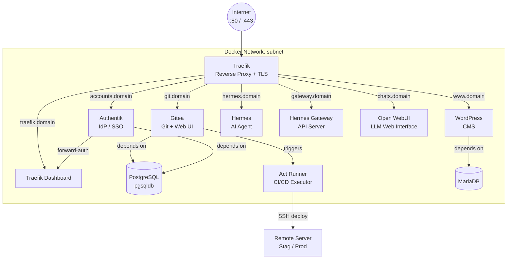

# Dockyard

> A quiet harbor where HomeLab services arrive, find their place, and don't get lost again

Dockyard is a self-hosted HomeLab services platform built on Docker Compose. It provides a curated stack of infrastructure and developer tools behind a single Traefik reverse proxy with automatic TLS — deployable to staging or production via a one-click Gitea Actions workflow.

## Table of Contents

- [Architecture Overview](#architecture-overview)
- [Project Structure](#project-structure)
- [Core Services](#core-services)
- [Web Applications](#web-applications)
    - [Hermes Agent](#hermes-agent)
    - [Open WebUI](#open-webui)
- [Prerequisites](#prerequisites)
- [Installation](#installation)
- [Managing Encrypted Files (git-crypt)](#managing-encrypted-files-git-crypt)
- [Deployment Workflows](#deployment-workflows)
- [Usage](#usage)
- [Configuration](#configuration)

---

## Architecture Overview

All traffic enters through Traefik on ports 80/443. HTTP is redirected to HTTPS. Traefik routes requests to the appropriate service by hostname and terminates TLS using either Let's Encrypt (production) or a self-signed certificate (staging). All services communicate over an isolated Docker bridge network (`subnet`). Databases are not exposed outside the network.



**TLS strategy:**
- **Staging:** self-signed certificate via `shared/traefik/advanced/certificates.yml`
- **Production:** Let's Encrypt ACME challenge; `acme.json` restored from an encrypted Gitea secret

---

## Project Structure

```
servicehub/
├── .gitea/
│   └── workflows/
│       └── deploy.yml          # Gitea Actions deployment workflow
├── compose/                    # Per-service Docker Compose files
│   ├── traefik.yml             # Traefik reverse proxy
│   ├── authentik.yml           # Authentik server + worker
│   ├── gitea.yml               # Gitea + Act Runner
│   ├── wordpress.yml           # WordPress CMS
│   ├── hermes.yml              # Hermes Agent gateway + dashboard
│   ├── openwebui.yml           # Open WebUI for LLMs
│   ├── mariadb.yml             # MariaDB database
│   └── pgsqldb.yml             # PostgreSQL database
├── shared/                     # Shared build contexts and static config
│   ├── traefik/
│   │   ├── Dockerfile
│   │   └── advanced/
│   │       ├── certificates.yml          # Self-signed TLS config (staging)
│   │       └── middlewares-authentik.yml # Authentik forward-auth middleware
│   ├── authentik/
│   │   └── Dockerfile
│   ├── gitea/
│   │   ├── Dockerfile
│   │   ├── custom/             # Custom Gitea landing page assets
│   │   └── runner/
│   │       └── Dockerfile      # Act Runner image
│   ├── wordpress/
│   │   ├── Dockerfile          # Nginx + PHP-FPM + WordPress (Alpine)
│   │   └── etc/
│   │       ├── nginx/          # Nginx configuration
│   │       └── supervisord.conf
│   ├── mariadb/
│   │   ├── Dockerfile
│   │   └── create-multiple-databases.sh
│   └── postgresql/
│       ├── Dockerfile
│       └── create-multiple-databases.sh
├── scripts/
│   └── setup.sh                # Local setup and secret encoding helper
├── docker-compose.yml          # Main entry point (includes all compose/ files)
├── env.example                 # Environment variable template
└── LICENSE
```

---

## Core Services

### Traefik (Reverse Proxy)

[Traefik v3](https://traefik.io/) is the single entry point for all web traffic.

| Detail | Value |
|---|---|
| HTTP port | 80 (redirects to HTTPS) |
| HTTPS port | 443 |
| Dashboard | `https://${TRAFIK_DOMAIN}` |
| TLS (prod) | Let's Encrypt via ACME |
| TLS (stag) | Self-signed from `shared/traefik/advanced/certificates.yml` |

Key behaviours:
- Automatic HTTP → HTTPS redirect for all services
- Docker provider: services opt in to routing via container labels
- Forward-auth and IP allowlist middleware stubs are in `compose/traefik.yml` (commented out) for easy activation

### MariaDB

[MariaDB 11.8](https://mariadb.org/) provides a MySQL-compatible relational database.

| Detail | Value |
|---|---|
| Internal port | 3306 (not exposed externally) |
| Multiple databases | Set `MARIADB_DB_LIST` (comma-separated) in `.env` |
| Data persistence | `${APPS_DATA}/databases/mariadb` |
| Health check | `innodb_initialized` every 10 s |

The init script `shared/mariadb/create-multiple-databases.sh` creates all databases listed in `MARIADB_DB_LIST` on first start.

### PostgreSQL

[PostgreSQL 16](https://www.postgresql.org/) is the primary relational database, used by Gitea.

| Detail | Value |
|---|---|
| Internal port | 5432 (not exposed externally) |
| Multiple databases | Set `PGRSQL_DBLIST` (comma-separated) in `.env` |
| Data persistence | `${APPS_DATA}/databases/pgsqldb` |
| Health check | `pg_isready` every 30 s (20 s startup delay) |

The init script `shared/postgresql/create-multiple-databases.sh` creates all databases listed in `PGRSQL_DBLIST` on first start.

---

## Web Applications

### Authentik (Identity Provider)

[Authentik](https://goauthentik.io/) is an open-source Identity Provider (IdP) and SSO solution. It provides forward-authentication for Traefik-protected services (e.g. the Traefik dashboard) and can be extended to cover any service in the stack.

| Detail | Value |
|---|---|
| URL | `https://${AUTHK_DOMAIN}` |
| Initial setup | Navigate to `https://${AUTHK_DOMAIN}/if/flow/initial-setup/` on first boot |
| Database | PostgreSQL (`${AUTHK_DBNAME}`) |
| Data persistence | `${APPS_DATA}/webapps/authentik/media` and `.../templates` |
| Image tag | Controlled by `AUTHK_TAG` (e.g. `2025.12`) |
| Forward-auth middleware | Defined in `shared/traefik/advanced/middlewares-authentik.yml` |

The stack runs two Authentik containers:

- **`authentik`** — the web server, started after the worker is running
- **`authenwk1`** — the background worker (handles flows, policies, notifications)

> **Note:** The Traefik dashboard is protected by Authentik forward-auth. It will be inaccessible until the Authentik initial setup flow is completed and a forward-auth outpost is configured in Authentik.

### WordPress

[WordPress](https://wordpress.org/) is served as a custom image bundling Nginx (reverse proxy) and PHP-FPM in a single Alpine-based container managed by Supervisord.

| Detail | Value |
|---|---|
| URL | `https://${WP_DOMAIN}` and `https://${DOMAIN_NAME}` (apex) |
| Database | MariaDB (`${WP_DBNAME}`) |
| Data persistence | `${APPS_DATA}/webapps/wwhome` (mounted as `/var/www/html`) |
| PHP extensions | `intl`, `zip`, `gd`, `opcache`, `imagick`, `exif`, `fileinfo` |
| Upload limit | 768 MB (configured in both PHP and Nginx) |
| www-data UID/GID | Matches host UID/GID via `WWW_DATA_UID`/`WWW_DATA_GID` build args (default `1000:1000`) |

> **Permissions:** The data directory must be owned by the same UID/GID as `WWW_DATA_UID`/`WWW_DATA_GID` (default `1000:1000`):
> ```bash
> mkdir -p ${APPS_DATA}/webapps/wwhome
> chown -R 1000:1000 ${APPS_DATA}/webapps/wwhome
> ```

### Gitea

[Gitea](https://gitea.io/) is a self-hosted Git service with a GitHub-compatible web UI, issue tracker, and pull requests.

| Detail | Value |
|---|---|
| URL | `https://${GIT_DOMAIN}` |
| Database | PostgreSQL (`${GIT_DBNAME}`) |
| Data persistence | `${APPS_DATA}/webapps/repbuk/data` |
| Config persistence | `${APPS_DATA}/webapps/repbuk/config` |
| Volume ownership | **`1000:1000`** — required; Gitea runs rootless |
| Registration | Disabled (admin-only account creation) |
| Auth | Local accounts only (OpenID and passkeys disabled) |
| Default branch | `master` |
| Health check | HTTP GET on port 3000 every 30 s (20 s startup delay) |

### Gitea Act Runner

The Act Runner executes Gitea Actions workflows. It mounts the Docker socket so workflows can build and run containers.

| Detail | Value |
|---|---|
| Registration | Token set via `GIT_RUNNER_TOKEN` in `.env` |
| Instance URL | `https://${GIT_DOMAIN}` |
| Runner data | `${APPS_DATA}/webapps/repbuk/runner` |
| Labels | Inherit from Gitea runner registration |

> **Note:** The runner must be registered in Gitea (`Site Administration → Actions → Runners`) before the first workflow can execute. Set the registration token as `GIT_RUNNER_TOKEN` in your `.env`.

### Hermes Agent

[Hermes Agent](https://hermes-agent.nousresearch.com) is a self-hosted AI agent platform by Nous Research. It provides a gateway API server and web dashboard for interacting with AI agents.

| Detail | Value |
|---|---|
| Dashboard URL | `https://${HERMES_DOMAIN}` |
| Gateway URL | `https://${HERMES_GATEWAY_DOMAIN}` |
| Gateway port | 8642 |
| Dashboard port | 9119 |
| Data persistence | `${APPS_DATA}/webapps/hermes` |
| Browser tools | Requires `--shm-size=1g` (already configured) |

The stack runs two containers:

- **`hermes`** — the gateway API server (`gateway run`)
- **`dashboard`** — the web dashboard for monitoring and interaction

> **Resource requirements:** The gateway is memory-intensive (recommended 4 GB). Ensure your host has adequate resources.

### Open WebUI

[Open WebUI](https://docs.openwebui.com/) is a web-based interface for interacting with Large Language Models (LLMs). It provides a chat UI, model management, and RAG capabilities.

| Detail | Value |
|---|---|
| URL | `https://${OPENWEBUI_DOMAIN}` |
| Internal port | 8080 (mapped to 3000 on host) |
| Data persistence | `${APPS_DATA}/webapps/openwebui` |
| Ollama endpoint | `http://host.docker.internal:11434` |

Open WebUI connects to Ollama running on the host machine. Ensure Ollama is installed and running with your desired models.

> **Resource requirements:** At least 2 GB RAM minimum, 4+ GB recommended. Requires sufficient disk space for model storage.

---

## Prerequisites

- **Docker** 24+ with the Compose plugin (`docker compose`) **or** the standalone `docker-compose` binary
- **Git** 2.x
- **git-crypt** (macOS: `brew install git-crypt`) — required to encrypt/decrypt self-signed certificates stored in the repo. The remote deploy server installs it automatically via the workflow.
- A domain name with DNS A records pointing to your server (for Let's Encrypt) **or** a local domain with a self-signed certificate (for staging)
- A Linux server with SSH access (for remote deployment)
- `openssl` (used by `setup.sh` to generate database passwords)

---

## Installation

### 1. Clone the Repository

```bash
git clone https://github.com/yongxinL/servicehub.git
cd servicehub
```

### 2. Initial Setup

Run the setup script to create your `.env` from the template. It auto-generates a strong `SQLDB_PASS` and sets correct file permissions:

```bash
bash scripts/setup.sh
```

If `.env` already exists (e.g., after pulling updates), the script merges new variables from `env.example` without overwriting existing values.

### 3. Configure Environment Variables

Edit `.env` to match your environment:

```bash
# Required — set these before first start
DOMAIN_NAME=example.com        # Your primary domain
GIT_DOMAIN=git.example.com     # Gitea hostname
TRAFIK_DOMAIN=traefik.example.com
ACME_EMAIL=you@example.com     # Let's Encrypt registration email
APPS_DATA=/opt/containerd      # Host path for persistent data
TIME_ZONE=Australia/Sydney
```

See [Configuration](#configuration) for the full variable reference.

### 4. Prepare the Let's Encrypt Directory

The `shared/letsencrypt/` directory is already included in the repository. Traefik will create `acme.json` automatically on the first successful Let's Encrypt certificate issuance — you do not need to create it manually.

> **Important:** After Traefik starts and `acme.json` is created, verify its permissions are restricted. Traefik will refuse to use the file if permissions are too open:
> ```bash
> chmod 600 shared/letsencrypt/acme.json
> ```
> For remote deployments via the Gitea Actions workflow, `acme.json` is restored automatically from the `*_B64ENC_ACME` secret (gzip+base64 encoded via `setup.sh --encode`) with the correct `600` permissions. The restore only overwrites the existing file if the secret is newer, preserving any certificates renewed by Traefik since the last encode.

For staging (self-signed), place your `.pem` and `.key` files in `shared/letsencrypt/` and update `shared/traefik/advanced/certificates.yml` accordingly. No `acme.json` is needed.

### 5. Prepare the Gitea Data Directory

Gitea runs as a rootless container (UID/GID `1000:1000`). The data and config directories on the host **must** be owned by `1000:1000`, otherwise Gitea will fail to start or write data.

```bash
mkdir -p ${APPS_DATA}/webapps/repbuk/data
mkdir -p ${APPS_DATA}/webapps/repbuk/config
mkdir -p ${APPS_DATA}/webapps/repbuk/runner
chown -R 1000:1000 ${APPS_DATA}/webapps/repbuk
```

Replace `${APPS_DATA}` with the actual path you set in `.env` (e.g. `/opt/containerd`).

### 6. Start All Services

```bash
docker compose up -d
```

Or start a specific service:

```bash
docker compose up -d gitea
```

---

## Managing Encrypted Files (git-crypt)

Self-signed certificates for staging are stored **encrypted** in `shared/letsencrypt/` using [git-crypt](https://github.com/AGWA/git-crypt). They appear as binary blobs to anyone without the key, making it safe to commit them to a public repository. The deploy workflow decrypts them automatically on the remote server.

### One-time Setup (new repository)

```bash
# 1. Initialise git-crypt in the repo (only needed once)
git-crypt init

# 2. Export the symmetric key — back this up securely (password manager, etc.)
#    Losing this key means losing access to all encrypted files permanently.
git-crypt export-key ./servicehub.key

# 3. Verify .gitattributes is present (already included in this repo)
cat .gitattributes
```

### Add Your Staging Certificates

Place your self-signed `.pem` and `.key` files in `shared/letsencrypt/` matching the filenames in `shared/traefik/advanced/certificates.yml`, then commit normally:

```bash
cp /path/to/selfcert.pem shared/letsencrypt/
cp /path/to/selfcert.key shared/letsencrypt/
cp /path/to/selfcertCA.crt shared/letsencrypt/
git add shared/letsencrypt/selfcert.pem shared/letsencrypt/selfcert.key shared/letsencrypt/selfcertCA.crt
git commit -m "add staging self-signed certificates (encrypted)"
```

git-crypt encrypts the files transparently on commit. Verify with:
```bash
# Should print non-text (encrypted) output — not your cert content
git show HEAD:shared/letsencrypt/selfcert.pem | file -
```

### Encode the Key for Gitea

The deploy workflow needs the key as a Gitea secret:

```bash
# Encode the binary key as base64
base64 -w0 servicehub.key
```

Copy the output into Gitea → Repository Settings → Secrets as **`GIT_CRYPT_KEY`**.

### Unlock on a New Machine

```bash
git-crypt unlock ./servicehub.key
```

---

## Deployment Workflows

The Gitea Actions workflow at [.gitea/workflows/deploy.yml](.gitea/workflows/deploy.yml) provides a manual, one-click deployment to staging or production over SSH.

### How It Works

1. Resolves environment-specific secrets from Gitea repository settings
2. Configures SSH known hosts from a stored secret (or falls back to `ssh-keyscan`)
3. On the remote server: clones the repo on first deploy, or pulls `main` on subsequent runs
4. Installs git-crypt on the remote server if needed, then decrypts encrypted files (e.g. staging certs)
5. Restores `.env` from the `*_B64ENC_ENVS` secret if the secret is newer than the existing file
6. Runs `scripts/setup.sh` to merge any new variables from `env.example` into `.env`
7. Restores `acme.json` from the `*_B64ENC_ACME` secret if the secret is newer than the existing file
8. Runs `docker compose up --build -d [service]` on the remote

> **Timestamp-based restore:** Both `.env` and `acme.json` are gzip-compressed before base64-encoding, which preserves the file's original mtime in the gzip header. On deploy, the workflow compares that mtime against the existing file on the server — the newer file always wins. This prevents a stale secret from overwriting a `.env` edited directly on the server or an `acme.json` renewed by Traefik since the last encode.

### Encoding Secrets for Gitea

Before triggering the workflow, encode your local `.env` and `acme.json` into Gitea secrets using the helper:

```bash
# For staging
bash scripts/setup.sh --encode STAG

# For production
bash scripts/setup.sh --encode PROD
```

The script outputs `.b64` files and prints instructions for copying their content into Gitea secrets.

### Required Gitea Secrets

Set these in **Repository Settings → Secrets → Add Secret**.

#### Shared (both environments)

| Secret | How to obtain | Description |
|---|---|---|
| `GIT_CRYPT_KEY` | `base64 -i servicehub.key \| tr -d '\n'` | Base64-encoded git-crypt symmetric key used to decrypt self-signed certificates on the remote server after git clone/pull. Generate with `git-crypt init && git-crypt export-key ./servicehub.key`. |

#### Staging (`STAG_*`)

| Secret | Example value | Description |
|---|---|---|
| `STAG_SERVER_HOST` | `192.168.1.10` or `stag.example.com` | IP address or hostname of the staging server. Used for SSH connection. |
| `STAG_SERVER_USER` | `deploy` | SSH login username on the staging server. |
| `STAG_SERVER_PASS` | `••••••••` | SSH password for the above user. |
| `STAG_DEPLOY_PATH` | `/home/username/servicehub` | Absolute path on the staging server where the repo is cloned. Must include the repo directory name — git clones **into** this path. |
| `STAG_B64ENC_ENVS` | *(output of `setup.sh --encode STAG`)* | Gzip+base64-encoded `.env` file. Generated by `bash scripts/setup.sh --encode STAG`. Restored on deploy only if the secret is newer than the existing `.env` on the server. |
| `STAG_B64ENC_ACME` | *(leave unset for staging)* | Gzip+base64-encoded `acme.json` (Let's Encrypt certificates). Leave **unset** for staging — Traefik uses the self-signed cert from `shared/letsencrypt/` instead. Only needed for production. |
| `STAG_SSHKWN_KEYS` | *(output of `ssh-keyscan <host>`)* | The staging server's public SSH host key. Prevents man-in-the-middle attacks by verifying the server identity before connecting. Get it by running `ssh-keyscan <stag-host>` locally. **Optional** — if unset the workflow falls back to `ssh-keyscan` at runtime with a warning. |

#### Production (`PROD_*`)

| Secret | Example value | Description |
|---|---|---|
| `PROD_SERVER_HOST` | `203.0.113.10` or `prod.example.com` | IP address or hostname of the production server. |
| `PROD_SERVER_USER` | `deploy` | SSH login username on the production server. |
| `PROD_SERVER_PASS` | `••••••••` | SSH password for the above user. |
| `PROD_DEPLOY_PATH` | `/home/username/servicehub` | Absolute path on the production server where the repo is cloned. |
| `PROD_B64ENC_ENVS` | *(output of `setup.sh --encode PROD`)* | Gzip+base64-encoded production `.env`. Generated by `bash scripts/setup.sh --encode PROD`. Restored on deploy only if the secret is newer than the existing `.env` on the server. |
| `PROD_B64ENC_ACME` | *(output of `setup.sh --encode PROD`)* | Gzip+base64-encoded `acme.json` containing your Let's Encrypt certificates. Generated by `setup.sh --encode PROD` when `acme.json` is larger than 1 KB (i.e. after Traefik has issued real certificates). Restored only if the secret is newer than the existing file. |
| `PROD_SSHKWN_KEYS` | *(output of `ssh-keyscan <host>`)* | The production server's public SSH host key. Strongly recommended for production. Run `ssh-keyscan <prod-host>` locally to get the value. |

> `GITEA_TOKEN` is injected automatically by Gitea Actions for the repository's own workflows — no manual setup needed.

### Triggering a Deployment

1. Navigate to **Repository → Actions → Deploy to Server**
2. Click **Run workflow**
3. Select the **service** (`all`, `traefik`, `authentik`, `wordpress`, `hermes`, `openwebui`, `gitea`, `mariadb`, `pgsqldb`, or `runner`) and **environment** (`stag` or `prod`)
4. Click **Run workflow**

---

## Usage

### Start / Stop Services

```bash
# Start all services
docker compose up -d

# Stop all services
docker compose down

# Restart a single service
docker compose restart gitea

# View logs
docker compose logs -f gitea
```

### Rebuild After a Config Change

```bash
docker compose up -d --build gitea
```

### Update All Images

```bash
docker compose pull && docker compose up -d
```

### Register the Act Runner

After Gitea starts, generate a runner token in Gitea (`Site Administration → Actions → Runners → Create new runner token`), add it to `.env` as `GIT_RUNNER_TOKEN`, then restart the runner:

```bash
docker compose restart runner
```

---

## Configuration

All settings are controlled via `.env`. The template [`env.example`](env.example) documents every variable. Key sections:

### General

| Variable | Default | Description |
|---|---|---|
| `TIME_ZONE` | `Australia/Sydney` | Container timezone |
| `APPS_DATA` | `~/Documents/containerd` | Host path for all persistent data |

### Domain & Network

| Variable | Description |
|---|---|
| `DOMAIN_NAME` | Primary domain (e.g. `example.com`) |
| `TRUSTED_IP` | CIDR ranges Traefik trusts for forwarded headers |

### TLS / Traefik

| Variable | Description |
|---|---|
| `TRAFIK_DOMAIN` | Traefik dashboard hostname |
| `ACME_EMAIL` | Let's Encrypt registration email |
| `TRAFIK_BAAUTH` | Dashboard basic-auth credentials (htpasswd format) |
| `CERTRESOLVER` | Set to `letsencrypt` for ACME; leave empty for self-signed |

### Authentik

| Variable | Description |
|---|---|
| `AUTHK_TAG` | Authentik image tag (e.g. `2025.12`) |
| `AUTHK_DOMAIN` | Authentik hostname (e.g. `accounts.example.com`) |
| `AUTHK_DBNAME` | PostgreSQL database name for Authentik |
| `AUTHK_PASSWD` | Auto-generated by `setup.sh`; Authentik DB password |
| `AUTHK_SECRET` | Auto-generated by `setup.sh`; Authentik secret key |

### WordPress

| Variable | Description |
|---|---|
| `WP_DOMAIN` | WordPress hostname (e.g. `www.example.com`) |
| `WP_DBNAME` | MariaDB database name for WordPress (default: `wordpress`) |

### Gitea

| Variable | Description |
|---|---|
| `GIT_DOMAIN` | Gitea hostname |
| `GIT_DBNAME` | PostgreSQL database name for Gitea |
| `GIT_RUNNER_TOKEN` | Act Runner registration token |

### Hermes Agent

| Variable | Description |
|---|---|
| `HERMES_DOMAIN` | Hermes dashboard hostname |
| `HERMES_GATEWAY_DOMAIN` | Hermes gateway API hostname |

### Open WebUI

| Variable | Description |
|---|---|
| `OPENWEBUI_DOMAIN` | Open WebUI hostname |

### Databases

| Variable | Description |
|---|---|
| `SQLDB_USER` | Shared DB username for both MariaDB and PostgreSQL |
| `SQLDB_PASS` | Auto-generated by `setup.sh`; store securely |
| `MARIADB_DB_LIST` | Comma-separated list of MariaDB databases to create |
| `PGRSQL_DBLIST` | Comma-separated list of PostgreSQL databases to create |

### Email (SMTP)

| Variable | Description |
|---|---|
| `SMTP_HOST` | SMTP server hostname |
| `SMTP_PORT` | SMTP port |
| `SMTP_USER` / `SMTP_PASS` | SMTP credentials |
| `SMTP_FROM` | From address for outbound email |

---

## License

GNU General Public License v3.0 — see [LICENSE](LICENSE) for details.
