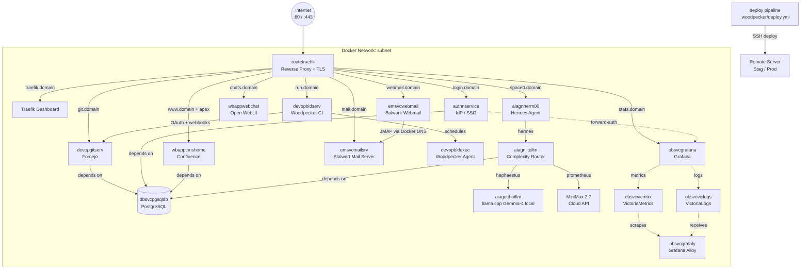
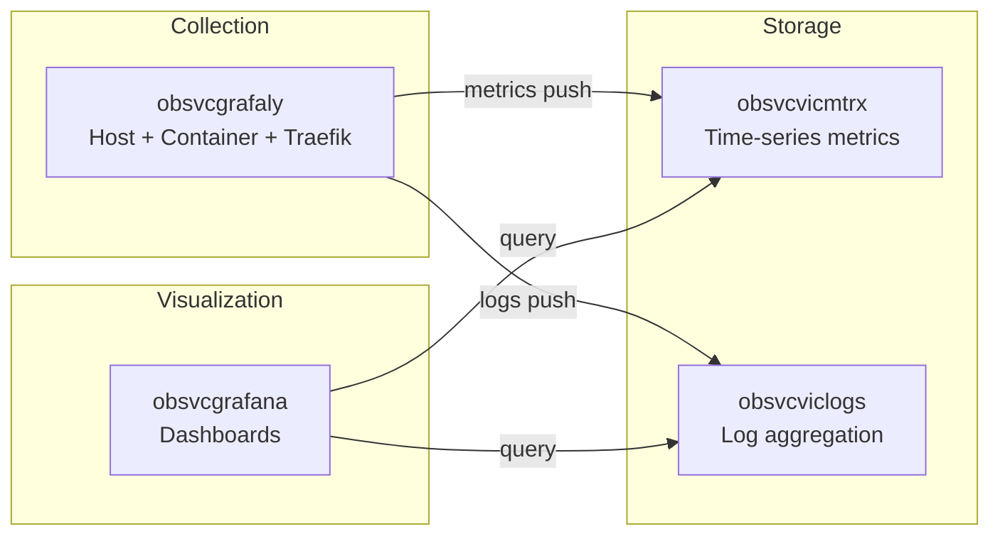

# ServiceHub

> A quiet harbor where HomeLab services arrive, find their place, and don't get lost again

ServiceHub is a self-hosted HomeLab services platform built on Docker Compose. It provides a curated stack of infrastructure, developer tools, an AI agent platform and an observability stack behind a single Traefik reverse proxy with automatic TLS — deployable to staging or production via a one-click Woodpecker CI workflow.

## Table of Contents

- [Architecture Overview](#architecture-overview)
- [Project Structure](#project-structure)
- [Core Services](#core-services)
- [DevOps Stack](#devops-stack)
- [AI Agent Platform (aiagn)](#ai-agent-platform-aiagn)
- [Web Applications](#web-applications)
- [Observability Stack (obsvc)](#observability-stack-obsvc)
- [Email Stack (emsvc)](#email-stack-emsvc)
- [Prerequisites](#prerequisites)
- [Installation](#installation)
- [Managing Encrypted Files (git-crypt)](#managing-encrypted-files-git-crypt)
- [Deployment (Woodpecker CI)](#deployment-woodpecker-ci)
- [Usage](#usage)
- [Configuration](#configuration)
- [License](#license)

---

## Architecture Overview

All traffic enters through Traefik on ports 80/443. HTTP is redirected to HTTPS. Traefik routes requests to the appropriate service by hostname and terminates TLS using either Let's Encrypt (production) or a self-signed certificate (staging). All services communicate over an isolated Docker bridge network (`subnet`). Databases are not exposed outside the network.

Compose files are split by functional domain:

| File | Prefix | Purpose |
|---|---|---|
| `compose/route.yml` | `route*` | Edge routing + TLS termination (Traefik) |
| `compose/dbsvc.yml` | `dbsvc*` | Relational databases (MariaDB + PostgreSQL) |
| `compose/authn.yml` | `authn*` | Authentication / SSO (Authentik) |
| `compose/wbapp.yml` | `wbapp*` | Homepage / CMS (Confluence) + Open WebUI |
| `compose/aiagn.yml` | `aiagn*` | AI agents + LLM inference (Hermes + LiteLLM + llama.cpp) |
| `compose/devop.yml` | `devop*` | Source control + CI (Forgejo + Woodpecker) |
| `compose/obsvc.yml` | `obsvc*` | Observability (metrics + logs + Grafana) |
| `compose/emsvc.yml` | `emsvc*` | Email services (Stalwart mail server + Bulwark webmail) |


```mermaid
graph TD
    Internet((Internet\n:80 / :443))
    Internet --> Traefik

    subgraph subnet[Docker Network: subnet]
        Traefik[routetraefik\nReverse Proxy + TLS]
        Traefik -->|traefik.domain| Dashboard[Traefik Dashboard]
        Traefik -->|login.domain| Authentik[authnservice\nIdP / SSO]
        Traefik -->|git.domain| Forgejo[devopgitserv\nForgejo]
        Traefik -->|run.domain| Woodpecker[devopbldserv\nWoodpecker CI]
        Traefik -->|www.domain + apex| Confluence[wbappcmshome\nConfluence]
        Traefik -->|chats.domain| OpenWebUI[wbappwebchat\nOpen WebUI]
        Traefik -->|space0.domain| Hermes[aiagnherm00\nHermes Agent]
        Traefik -->|stats.domain| Grafana[obsvcgrafana\nGrafana]
        Traefik -->|mail.domain| Stalwart[emsvcmailsrv\nStalwart Mail Server]
        Traefik -->|webmail.domain| Bulwark[emsvcwebmail\nBulwark Webmail]
        Bulwark -->|JMAP via Docker DNS| Stalwart
        Authentik -.->|forward-auth| Grafana
        Forgejo -->|depends on| PostgreSQL[(dbsvcpgsqldb\nPostgreSQL)]
        Authentik -->|depends on| PostgreSQL
        Confluence -->|depends on| PostgreSQL
        Woodpecker -->|OAuth + webhooks| Forgejo
        Woodpecker -->|schedules| Agent[devopbldexec\nWoodpecker Agent]
        Hermes -->|hermes| LiteLLM[aiagnlitellm\nComplexity Router]
        LiteLLM -->|depends on| PostgreSQL
        LiteLLM -->|hephaestus| Gemma[aiagnchatllm\nllama.cpp Gemma-4 local]
        LiteLLM -->|prometheus| MiniMax[MiniMax 2.7\nCloud API]
        Grafana -.->|metrics| VM[obsvcvicmtrx\nVictoriaMetrics]
        Grafana -.->|logs| VL[obsvcviclogs\nVictoriaLogs]
        VM -.->|scrapes| Alloy[obsvcgrafaly\nGrafana Alloy]
        VL -.->|receives| Alloy
    end

    WPDeploy[deploy pipeline\n.woodpecker/deploy.yml] -->|SSH deploy| RemoteServer[Remote Server\nStag / Prod]
```

**TLS strategy:**
- **Staging:** self-signed certificate from `shared/traefik/advanced/selfsigncert/` (git-crypt encrypted, referenced by `shared/traefik/advanced/certificates.yml`)
- **Production:** Let's Encrypt ACME TLS challenge; `acme.json` is stored at `${APPS_DATA}/certs/acme.json` and restored from an encrypted Woodpecker secret on deploy

---

## Project Structure

```
servicehub/
├── .woodpecker/
│   └── deploy.yml               # Woodpecker CI deployment workflow
├── compose/                    # Per-domain Docker Compose files
│   ├── route.yml               # Traefik (routetraefik)
│   ├── dbsvc.yml               # MariaDB + PostgreSQL
│   ├── authn.yml               # Authentik server + worker + init
│   ├── wbapp.yml               # Homepage / CMS (Confluence) + Open WebUI
│   ├── aiagn.yml               # Hermes agents + LiteLLM + llama.cpp
│   ├── devop.yml               # Forgejo + Woodpecker CI server/agent
│   ├── obsvc.yml               # Observability stack (VictoriaMetrics + VictoriaLogs + Grafana)
│   └── emsvc.yml               # Email services (Stalwart mail server + Bulwark webmail)
├── shared/                     # Shared build contexts and static config
│   ├── traefik/
│   │   ├── README.md                     # Traefik service documentation
│   │   ├── Dockerfile
│   │   └── advanced/
│   │       ├── certificates.yml          # Self-signed TLS config (staging)
│   │       ├── middlewares-authentik.yml # Authentik forward-auth middleware
│   │       ├── metrics.yml               # Traefik Prometheus metrics config
│   │       └── selfsigncert/             # git-crypt encrypted cert/key material
│   ├── authentik/
│   │   ├── README.md                     # Authentik service documentation
│   │   └── Dockerfile
│   ├── forgejo/
│   │   ├── README.md                     # Forgejo service documentation
│   │   └── server/Dockerfile
│   ├── woodpecker/
│   │   ├── README.md                     # Woodpecker CI service documentation
│   │   ├── server/Dockerfile
│   │   └── agent/Dockerfile
│   ├── confluence/
│   │   ├── README.md                     # Confluence service documentation
│   │   ├── Dockerfile
│   │   └── plugins/
│   ├── hermesagent/
│   │   ├── README.md                     # Hermes Agent documentation
│   │   ├── README.html                   # Full Hermes setup guide
│   │   ├── Dockerfile
│   │   ├── start-gateways.sh             # Entrypoint: seeds defaults, starts gateway + workspace
│   │   ├── apply-overlay.sh              # Replays persisted /opt/hermes edits at startup
│   │   ├── overlay-*                     # Overlay tooling (track / save / patch)
│   │   └── default/                      # Default profile files baked into the image
│   ├── litellm/
│   │   ├── README.md                     # LiteLLM service documentation
│   │   ├── Dockerfile
│   │   ├── config.default.yaml           # LiteLLM routing config (baked into image)
│   │   ├── smartrouter.py                # Content-based routing hook (privacy + complexity)
│   │   └── entrypoint.sh
│   ├── llamacpp/
│   │   ├── README.md                     # llama.cpp chat inference documentation
│   │   ├── Dockerfile
│   │   └── entrypoint.sh                 # Reads LLAMA_* env vars
│   ├── openwebui/
│   │   ├── README.md                     # Open WebUI service documentation
│   │   └── Dockerfile
│   ├── fastcrw/                          # Optional web-search stack (not included by default)
│   │   ├── README.md                     # FastCRW + renderers + SearXNG documentation
│   │   ├── compose.yml                   # aiagnfastcrw
│   │   ├── config.docker.toml
│   │   ├── entrypoint.sh
│   │   ├── chromium/                     # aiagnchromum — browserless stealth renderer
│   │   │   ├── compose.yml
│   │   │   └── Dockerfile
│   │   └── lightpanda/                   # aiagnlighpda — LightPanda JS renderer
│   │       ├── compose.yml
│   │       └── Dockerfile
│   ├── searxng/                          # Optional search backend
│   │   ├── compose.yml                   # aiagnsearxng
│   │   └── Dockerfile
│   ├── grafana/
│   │   ├── README.md                     # Grafana service documentation
│   │   ├── Dockerfile
│   │   ├── alloy/                        # Grafana Alloy config + README
│   │   ├── dashboards/                   # Pre-built observability dashboards
│   │   ├── geoip/                        # GeoIP database for log enrichment
│   │   └── provisioning/                 # Grafana datasources + dashboard provisioning
│   ├── victoriametrics/
│   │   ├── README.md                     # VictoriaMetrics documentation
│   │   ├── Dockerfile
│   │   └── scrape.yaml                   # Metrics scrape configuration
│   ├── victorialogs/
│   │   ├── README.md                     # VictoriaLogs documentation
│   │   └── Dockerfile
│   ├── mariadb/
│   │   ├── README.md                     # MariaDB service documentation
│   │   ├── Dockerfile
│   │   └── create-multiple-databases.sh
│   ├── postgresql/
│   │   ├── README.md                     # PostgreSQL service documentation
│   │   ├── Dockerfile
│   │   └── create-multiple-databases.sh
│   ├── stalwart/                          # Stalwart Mail Server (emsvcmailsrv)
│   │   ├── README.md                      # Stalwart service documentation
│   │   ├── Dockerfile
│   │   ├── config.json                    # Minimal Stalwart SQLite config override
│   │   ├── entrypoint.sh                  # Bootstrap cert + privilege drop
│   │   └── acme-export.sh                 # Extracts certs from Traefik's acme.json
│   ├── bulwark/                           # Bulwark Webmail (emsvcwebmail)
│   │   ├── README.md                      # Bulwark service documentation
│   │   └── Dockerfile
│   └── wordpress/                        # Optional alternative homepage (not included by default)
│       ├── README.md
│       ├── compose.yml
│       └── ...
├── scripts/
│   └── setup.sh                 # Local setup, env merge and secret encoding helper
├── docker-compose.yml          # Main entry point (includes all compose/ files)
├── env.example                 # Environment variable template
└── LICENSE
```

---

## Core Services

| Service | Runs as | Full documentation |
|---|---|---|
| Traefik v3 — edge router + TLS termination | `routetraefik` | [shared/traefik/README.md](shared/traefik/README.md) |
| MariaDB 11.8 — MySQL-compatible database | `dbsvcmariadb` | [shared/mariadb/README.md](shared/mariadb/README.md) |
| PostgreSQL 16 — primary database | `dbsvcpgsqldb` | [shared/postgresql/README.md](shared/postgresql/README.md) |

> Service-specific configuration, data layout, first-boot steps and operations notes live in each service's own `README.md` under `shared/`.

---

## DevOps Stack

| Service | Runs as | Full documentation |
|---|---|---|
| Forgejo — self-hosted Git service | `devopgitserv` | [shared/forgejo/README.md](shared/forgejo/README.md) |
| Woodpecker CI — server + agent | `devopbldserv`, `devopbldexec` | [shared/woodpecker/README.md](shared/woodpecker/README.md) |

Setup, configuration, OAuth, agent registration and operations are documented in the service READMEs. Woodpecker also deploys ServiceHub itself — see [Deployment (Woodpecker CI)](#deployment-woodpecker-ci).

---

## AI Agent Platform (aiagn)

Local and cloud LLM services power the Hermes AI agents. The llama.cpp server provides fast, private on-device inference; LiteLLM acts as a unified API gateway and complexity router between local and cloud providers. All AI services live in [`compose/aiagn.yml`](compose/aiagn.yml).

| Service | Runs as | Full documentation |
|---|---|---|
| Hermes Agent — single shared agent workspace + gateway | `aiagnherm00` (+ one-shot `aiagnhermint`) | [shared/hermesagent/README.md](shared/hermesagent/README.md) |
| LiteLLM Proxy — unified API gateway + complexity router | `aiagnlitellm` | [shared/litellm/README.md](shared/litellm/README.md) |
| llama.cpp chat inference — local Gemma tier | `aiagnchatllm` | [shared/llamacpp/README.md](shared/llamacpp/README.md) |

**At a glance:**

| Detail | Value |
|---|---|
| Hermes workspace port | 12320 (login with `HERMES_WORKSPACE_PASSWD_00`) |
| Hermes gateway API port | 12330 (internal) |
| LiteLLM admin UI | `http://<host>:12380/ui` |
| Local model | Gemma 4 GGUF on llama.cpp (`hephaestus`) |
| Cloud model | MiniMax 2.7 (`prometheus`) |

**LLM routing from Hermes:** all agent requests use `model: hermes`; the LiteLLM proxy routes to hephaestus (local Gemma) or prometheus (MiniMax 2.7) based on message content. Users can override by prefixing their message:

```
[cloud] write a grant proposal for the school...   → prometheus / MiniMax 2.7
[c] debug this system architecture...              → prometheus / MiniMax 2.7 (shorthand)
[edge] summarise my tax return                    → hephaestus / Gemma (stays private)
[e] translate this paragraph                       → hephaestus / Gemma (shorthand)
```

See [shared/litellm/README.md](shared/litellm/README.md#routing-logic) for the full routing rules, and [shared/hermesagent/README.md](shared/hermesagent/README.md) for the workspace, overlay system and profiles.

### Multi-user & scaling

Hermes Agent is **single-user / single-tenant**: one container serves exactly one login and one agent identity. Everything under a Hermes home — sessions, `MEMORY.md`, `USER.md`, skills and `state.db` — is shared by anyone logged into that container. Upstream is explicit that profiles are *configuration, not a person* and that profile multiplexing "does not authenticate or authorize end users". See [shared/hermesagent/README.md](shared/hermesagent/README.md#multi-user-support) for the full findings.

The stack therefore ships **one** Hermes Agent (`aiagnherm00`) that acts as a shared team assistant. When more people need their **own** private agent, add another isolated container rather than sharing one login. To scale to N users, replicate the `aiagnherm00` pattern in [`compose/aiagn.yml`](compose/aiagn.yml):

1. **Add a data volume + init entry** — extend `aiagnhermint` with `/data0X`, or add a sibling init container, pointing at `${APPS_DATA}/hermesagent/0X`.
2. **Duplicate the `aiagnherm00` service** as `aiagnherm0X`, with:
   - its own `${HERMES_DATA_0X}:/opt/data` volume,
   - its own `HERMES_WORKSPACE_PASSWD_0X` and (optionally) `HERMES_WORKSPACE_DOMAIN_0X`,
   - a unique host port (`1232X:12320`).
3. **Add the matching `HERMES_WORKSPACE_PASSWD_0X`, `HERMES_DATA_0X` and `HERMES_WORKSPACE_DOMAIN_0X`** variables to `.env` / [`env.example`](env.example).
4. **Recreate** with `docker compose up -d --build aiagnherm0X`.

All agents share the same `aiagnlitellm` router and `aiagnchatllm` model, so GPU/RAM scaling is handled centrally there — only per-user data and the workspace need duplicating. For identity-aware routing you can front the agents with Authentik and map each user to a container, but do **not** point multiple people at a single Hermes login.

---

## Web Applications

| Service | Runs as | Full documentation |
|---|---|---|
| Authentik — IdP / SSO | `authnservice`, `authnworkers` (+ one-shot `authnsvrinit`) | [shared/authentik/README.md](shared/authentik/README.md) |
| Confluence Data Center — homepage / CMS | `wbappcmshome` | [shared/confluence/README.md](shared/confluence/README.md) |
| Open WebUI — browser LLM chat interface | `wbappwebchat` | [shared/openwebui/README.md](shared/openwebui/README.md) |

Confluence serves `WBHOME_DOMAIN` (default `www.${DOMAIN_NAME}`) and the apex `${DOMAIN_NAME}` through Traefik, backed by PostgreSQL (`${WBHOME_DBNAME}`). Open WebUI is served at `https://${OWEBUI_DOMAIN}`.

> **Database lists only initialize empty data directories.** Updating `PGRSQL_DBLIST` or `MARIADB_DB_LIST` does not create databases or change credentials in an existing installation; provision any missing database and grants explicitly without resetting existing data.
>
> An optional [WordPress homepage](shared/wordpress/README.md) can replace Confluence; the two must never run together.

---

## Observability Stack (obsvc)

A full metrics and log observability stack built on Grafana, VictoriaMetrics, VictoriaLogs, and Grafana Alloy. All components live in [`compose/obsvc.yml`](compose/obsvc.yml).

| Component | Runs as | Full documentation |
|---|---|---|
| VictoriaMetrics — time-series metrics store | `obsvcvicmtrx` | [shared/victoriametrics/README.md](shared/victoriametrics/README.md) |
| VictoriaLogs — log aggregation | `obsvcviclogs` | [shared/victorialogs/README.md](shared/victorialogs/README.md) |
| Grafana Alloy — host/container/metrics/log collector | `obsvcgrafaly` | [shared/grafana/alloy/README.md](shared/grafana/alloy/README.md) |
| Grafana — dashboards for metrics and logs | `obsvcgrafana` (+ one-shot `obsvcgrafint`) | [shared/grafana/README.md](shared/grafana/README.md) |


```mermaid
graph LR
    subgraph Collectors[Collection]
        Alloy[obsvcgrafaly\nHost + Container + Traefik]
    end
    subgraph Storage[Storage]
        VM[obsvcvicmtrx\nTime-series metrics]
        VL[obsvcviclogs\nLog aggregation]
    end
    subgraph Visualization[Visualization]
        Grafana[obsvcgrafana\nDashboards]
    end
    Alloy -->|metrics push| VM
    Alloy -->|logs push| VL
    Grafana -->|query| VM
    Grafana -->|query| VL
```

Grafana is reachable at `https://${OBSVC_DOMAIN}` behind Authentik forward-auth and ships pre-built dashboards for node, Docker/cAdvisor, Traefik, VictoriaMetrics, LiteLLM and VictoriaLogs.

---

## Email Stack (emsvc)

A self-hosted email stack: [Stalwart](https://github.com/stalwartlabs/stalwart) provides SMTP, IMAP and JMAP in one server; [Bulwark](https://github.com/bulwarkmail/webmail) provides the JMAP webmail UI. All services live in [`compose/emsvc.yml`](compose/emsvc.yml).

| Service | Runs as | Full documentation |
|---|---|---|
| Stalwart Mail Server — SMTP / IMAP / JMAP + web admin | `emsvcmailsrv` | [shared/stalwart/README.md](shared/stalwart/README.md) |
| Bulwark Webmail — JMAP webmail client | `emsvcwebmail` | [shared/bulwark/README.md](shared/bulwark/README.md) |

**At a glance:**

| Detail | Value |
|---|---|
| Mail server (Stalwart admin) | `https://${EMAIL_HOST}` — reachable from trusted IPs only |
| Webmail (Bulwark) | `https://${WEBMAIL_DOMAIN}` |
| Ports published to the host | 25 / 465 / 587 / 993 (SMTP server-to-server, submission ×2, IMAP) |
| TLS | Reused from Traefik's shared `acme.json` via an in-container certificate exporter |
| Webmail → Stalwart | JMAP over the Docker network, no CORS setup needed |
| Single sign-on | Bulwark uses Authentik OIDC when `WEBMAIL_OIDC_ENABLED=true` |

The SMTP/IMAP ports are reachable directly (bypassing Traefik); DNS `MX`/`A` records for `${EMAIL_HOST}` must point at the host. Other stack components send mail through Stalwart using the `EMAIL_*` variables documented in [Configuration](#configuration).

---

## Prerequisites

- **Docker** 24+ with **Compose 2.20+** (`docker compose` or standalone `docker-compose` v2) for `include` support
- **python3** 3.8+ (required by `scripts/setup.sh`)
- **Git** 2.x
- **git-crypt** (macOS: `brew install git-crypt`) — required to encrypt/decrypt self-signed certificates stored in the repo. The remote deploy server installs it automatically via the workflow.
- A domain name with DNS A records pointing to your server (for Let's Encrypt) **or** a local domain with a self-signed certificate (for staging)
- A Linux server with SSH access (for remote deployment)
- `openssl` (used by `setup.sh` to generate database passwords)

---

## Installation

### 1. Clone the Repository

```bash
git clone https://github.com/yongxinL/servicehub.git
cd servicehub
```

### 2. Initial Setup

Run the setup script to create your `.env` from the template. It auto-generates strong passwords and API keys for all services:

```bash
bash scripts/setup.sh
```

If `.env` already exists (e.g., after pulling updates), the script merges new variables from `env.example` without overwriting existing values, and migrates renamed legacy variables (e.g. `SECOB_*` → `OBSVC_*`).

### 3. Configure Environment Variables

Edit `.env` to match your environment:

```bash
# Required — set these before first start
DOMAIN_NAME=example.com          # Your primary domain
TRAEFIK_DOMAIN=traefik.example.com
AUTHN_DOMAIN=login.example.com   # Authentik hostname
GITREPO_DOMAIN=git.example.com   # Forgejo hostname
GITBLD_DOMAIN=run.example.com    # Woodpecker CI hostname
TRAEFIK_ACMEMAIL=you@example.com # Let's Encrypt registration email
APPS_DATA=~/Documents/containerd # Default host path for persistent data
TIME_ZONE=Australia/Sydney
WBHOME_DOMAIN=www.${DOMAIN_NAME}
WBHOME_DBNAME=svchubwbhome
WBCONF_TAG=10.2
```

See [Configuration](#configuration) for the variable reference. For an existing installation, retain database names and credentials rather than copying new-install defaults.

### 4. Prepare TLS

For **production** (Let's Encrypt), Traefik creates `${APPS_DATA}/certs/acme.json` automatically on the first successful certificate issuance — no manual step is needed. Verify its permissions are restricted after it is created (Traefik refuses to use a world-readable file):

```bash
chmod 600 ${APPS_DATA}/certs/acme.json
```

For **staging** (self-signed), place your `.pem` and `.key` files in `shared/traefik/advanced/selfsigncert/` matching `shared/traefik/advanced/certificates.yml`. These are encrypted with git-crypt before committing. No `acme.json` is needed.

For remote deployments via the Woodpecker CI workflow, `acme.json` is restored automatically from the `*_B64ENC_ACME` secret (gzip+base64 encoded via `setup.sh --encode`) with `600` permissions. The restore only overwrites the existing file if the secret is newer, preserving certificates renewed by Traefik since the last encode.

### 5. Prepare Data Directories

Service init containers (`authnsvrinit`, `devopbldinit`, `aiagnhermint`, `obsvcgrafint`) fix ownership on every boot. To prepare directories ahead of time:

```bash
mkdir -p ${APPS_DATA}/databases/{mariadb,pgsqldb}
mkdir -p ${APPS_DATA}/webapps/authentik/{media,templates}
mkdir -p ${APPS_DATA}/certs
mkdir -p ${APPS_DATA}/devops/{repos,buildserv,buildexec}
mkdir -p ${APPS_DATA}/hermesagent/00
mkdir -p ${APPS_DATA}/mailbox/{stalwart,bulwark}
chown -R 1000:1000 ${APPS_DATA}/mailbox/bulwark
chown -R 1000:1000 ${APPS_DATA}/devops
```

Replace `${APPS_DATA}` with the actual path you set in `.env` (default: `~/Documents/containerd`). Homepage data lives under `${APPS_DATA}/webapps/confluence`; follow the service README for directory ownership.

### 6. Start the Stack

Start the base services and the default homepage (Confluence).

```bash
docker compose up -d
```

Or start a specific service:

```bash
docker compose up -d devopgitserv
```

---

## Managing Encrypted Files (git-crypt)

Self-signed certificates for staging are stored **encrypted** in `shared/traefik/advanced/selfsigncert/` using [git-crypt](https://github.com/AGWA/git-crypt). They appear as binary blobs to anyone without the key, making it safe to commit them. The deploy workflow decrypts them automatically on the remote server.

### One-time Setup (new repository)

```bash
# 1. Initialise git-crypt in the repo (only needed once)
git-crypt init

# 2. Export the symmetric key — back this up securely (password manager, etc.)
#    Losing this key means losing access to all encrypted files permanently.
git-crypt export-key ./servicehub.key

# 3. Verify .gitattributes is present (already included in this repo)
cat .gitattributes
```

`.gitattributes` encrypts every certificate file under the self-signed cert directory:

```
shared/traefik/advanced/selfsigncert/*.pem filter=git-crypt diff=git-crypt
shared/traefik/advanced/selfsigncert/*.key filter=git-crypt diff=git-crypt
shared/traefik/advanced/selfsigncert/*.crt filter=git-crypt diff=git-crypt
shared/traefik/advanced/selfsigncert/*.pfx filter=git-crypt diff=git-crypt
```

### Add Your Staging Certificates

Place your self-signed files in `shared/traefik/advanced/selfsigncert/` matching the names in `shared/traefik/advanced/certificates.yml`, then commit normally:

```bash
cp /path/to/selfcert.pem    shared/traefik/advanced/selfsigncert/
cp /path/to/selfcert.key    shared/traefik/advanced/selfsigncert/
cp /path/to/selfcertCA.crt  shared/traefik/advanced/selfsigncert/
git add shared/traefik/advanced/selfsigncert/
git commit -m "add staging self-signed certificates (encrypted)"
```

git-crypt encrypts the files transparently on commit. Verify with:
```bash
# Should print non-text (encrypted) output — not your cert content
git show HEAD:shared/traefik/advanced/selfsigncert/selfcert.pem | file -
```

### Encode the Key for Woodpecker

The deploy workflow needs the key as a Woodpecker secret:

```bash
# Encode the binary key as base64
base64 -w0 servicehub.key
```

Copy the output into Woodpecker → Repository → Settings → Secrets as **`GIT_CRYPT_KEY`**.

### Unlock on a New Machine

```bash
git-crypt unlock ./servicehub.key
```

---

## Deployment (Woodpecker CI)

The Woodpecker CI workflow at [.woodpecker/deploy.yml](.woodpecker/deploy.yml) provides a one-click deployment to staging or production over SSH. All deploy logic is inline in the workflow, which runs in the stack's own Woodpecker instance (`devopbldexec`). Deploying **all** services or a **single** service works the same as before — leave the deploy task empty for all services, or name one compose service (see [Triggering a Deployment](#triggering-a-deployment)).

The workflow triggers on two events:

| Event | Behaviour |
|---|---|
| `manual` (Run pipeline) | Deploys the selected branch to **staging** (`stag`), all services |
| `deployment` (Deploy button) | Deploys to the chosen **deploy target** (`stag` or `prod`) and, optionally, a single compose service as the **deploy task** |

### How It Works

1. Selects the `STAG_*` or `PROD_*` secrets from the deploy target (`CI_PIPELINE_DEPLOY_TARGET`), defaulting to staging for manual runs
2. Configures SSH known hosts from a stored secret (or falls back to `ssh-keyscan`)
3. On the remote server: clones the repo on first deploy, or pulls the branch on subsequent runs
4. Installs git-crypt on the remote server if needed, then decrypts encrypted files (e.g. staging certs)
5. Restores `.env` from the `*_B64ENC_ENVS` secret if the secret is newer than the existing file
6. Runs `scripts/setup.sh` to merge any new variables from `env.example` into `.env`
7. Restores `acme.json` from the `*_B64ENC_ACME` secret if the secret is newer than the existing file
8. Runs `docker compose up --build -d [service]` on the remote

> **Timestamp-based restore:** Both `.env` and `acme.json` are gzip-compressed before base64-encoding, which preserves the file's original mtime in the gzip header. On deploy, the workflow compares that mtime against the existing file on the server — the newer file always wins. This prevents a stale secret from overwriting a `.env` edited directly on the server or an `acme.json` renewed by Traefik since the last encode.

### Encoding Secrets for Woodpecker

Before triggering the workflow, encode your local `.env` and `acme.json` into Woodpecker secrets using the helper:

```bash
# For staging
bash scripts/setup.sh --encode STAG

# For production
bash scripts/setup.sh --encode PROD
```

The script outputs `.b64` files and prints instructions for copying their content into Woodpecker secrets.

### Required Woodpecker Secrets

Set these in **Woodpecker → Repository → Settings → Secrets**.

> **Secret events:** each secret must be enabled for the **`manual`** and **`deployment`** events (the defaults only cover `push`, `tag`, `release` and `deployment`). Add `manual` to every secret, or Run pipeline will fail. Woodpecker also fails the pipeline when a referenced secret is missing, so create **all** secrets listed below — leave unused ones empty.

#### Shared (both environments)

| Secret | How to obtain | Description |
|---|---|---|
| `GITREPO_DEPLOY_TOKEN` | Forgejo → Settings → Applications → Access Token (repo read scope) | Forgejo access token used by the deploy step to clone/pull the repository on the remote server. |
| `GIT_CRYPT_KEY` | `base64 -i servicehub.key \| tr -d '\n'` | Base64-encoded git-crypt symmetric key used to decrypt self-signed certificates on the remote server after git clone/pull. Generate with `git-crypt init && git-crypt export-key ./servicehub.key`. |

#### Staging (`STAG_*`)

| Secret | Example value | Description |
|---|---|---|
| `STAG_SERVER_HOST` | `192.168.1.10` or `stag.example.com` | IP address or hostname of the staging server. Used for SSH connection. |
| `STAG_SERVER_USER` | `deploy` | SSH login username on the staging server. |
| `STAG_SERVER_PASS` | `••••••••` | SSH password for the above user. |
| `STAG_DEPLOY_PATH` | `/home/username/servicehub` | Absolute path on the staging server where the repo is cloned. Must include the repo directory name — git clones **into** this path. |
| `STAG_B64ENC_ENVS` | *(output of `setup.sh --encode STAG`)* | Gzip+base64-encoded `.env` file. Restored on deploy only if the secret is newer than the existing `.env` on the server. |
| `STAG_B64ENC_ACME` | *(leave the value empty for staging)* | Gzip+base64-encoded `acme.json` (Let's Encrypt certificates). For staging, create the secret with an **empty value** — Traefik uses the self-signed cert from `shared/traefik/advanced/selfsigncert/` instead. The secret must exist so Woodpecker can resolve it. |
| `STAG_SSHKWN_KEYS` | *(output of `ssh-keyscan <host>`)* | The staging server's public SSH host key. Prevents man-in-the-middle attacks by verifying the server identity before connecting. **Optional** — if unset the deploy script falls back to `ssh-keyscan` at runtime with a warning. |

#### Production (`PROD_*`)

| Secret | Example value | Description |
|---|---|---|
| `PROD_SERVER_HOST` | `203.0.113.10` or `prod.example.com` | IP address or hostname of the production server. |
| `PROD_SERVER_USER` | `deploy` | SSH login username on the production server. |
| `PROD_SERVER_PASS` | `••••••••` | SSH password for the above user. |
| `PROD_DEPLOY_PATH` | `/home/username/servicehub` | Absolute path on the production server where the repo is cloned. |
| `PROD_B64ENC_ENVS` | *(output of `setup.sh --encode PROD`)* | Gzip+base64-encoded production `.env`. Restored on deploy only if the secret is newer than the existing `.env` on the server. |
| `PROD_B64ENC_ACME` | *(output of `setup.sh --encode PROD`)* | Gzip+base64-encoded `acme.json` containing your Let's Encrypt certificates. Generated by `setup.sh --encode PROD` when `acme.json` is larger than 1 KB (i.e. after Traefik has issued real certificates). Restored only if the secret is newer than the existing file. |
| `PROD_SSHKWN_KEYS` | *(output of `ssh-keyscan <host>`)* | The production server's public SSH host key. Strongly recommended for production. Run `ssh-keyscan <prod-host>` locally to get the value. |

### Triggering a Deployment

1. Open the repository in Woodpecker (`https://${GITBLD_DOMAIN}`) → **Pipelines**
2. For **staging**: click **Run pipeline** on the `main` branch (or on a branch you want to deploy) — the `manual` event deploys all services to staging
3. For **staging or production**: open a recent successful pipeline and click **Deploy** — set the **environment** to the deploy target (`stag` or `prod`) and, optionally, the **task** to a single compose service (`routetraefik`, `dbsvcmariadb`, `dbsvcpgsqldb`, `authnservice`, `authnworkers`, `devopgitserv`, `devopbldserv`, `devopbldexec`, `wbappcmshome`, `wbappwebchat`, `aiagnlitellm`, `aiagnchatllm`, `aiagnherm00`, `obsvcvicmtrx`, `obsvcviclogs`, `obsvcgrafaly`, `obsvcgrafana`, `emsvcmailsrv`, or `emsvcwebmail`); leave the task empty to deploy **all** services

---

## Usage

### Start / Stop Services

```bash
# Start all services
docker compose up -d

# Stop all services
docker compose down

# Restart a single service
docker compose restart devopgitserv

# View logs
docker compose logs -f devopgitserv
```

### Rebuild After a Config Change

```bash
docker compose up -d --build devopgitserv
```

### Update All Images

```bash
docker compose pull && docker compose up -d
```

---

## Configuration

All settings are controlled via `.env`. The template [`env.example`](env.example) documents every variable. Key sections:

> Services with a dedicated README ([Traefik](shared/traefik/README.md), [Authentik](shared/authentik/README.md), [MariaDB](shared/mariadb/README.md), [PostgreSQL](shared/postgresql/README.md), [Forgejo](shared/forgejo/README.md), [Woodpecker CI](shared/woodpecker/README.md), [Confluence](shared/confluence/README.md), [Hermes Agent](shared/hermesagent/README.md), [LiteLLM](shared/litellm/README.md), [llama.cpp](shared/llamacpp/README.md), [Open WebUI](shared/openwebui/README.md), [VictoriaMetrics](shared/victoriametrics/README.md), [VictoriaLogs](shared/victorialogs/README.md), [Grafana](shared/grafana/README.md), [Stalwart](shared/stalwart/README.md), [Bulwark](shared/bulwark/README.md)) also document their own variables there.

### General

| Variable | Default | Description |
|---|---|---|
| `TIME_ZONE` | `Australia/Sydney` | Container timezone |
| `APPS_DATA` | `~/Documents/containerd` | Host path for all persistent data |

### Domain & Network

| Variable | Description |
|---|---|
| `DOMAIN_NAME` | Primary domain (e.g. `example.com`) |
| `TRUSTED_IP` | CIDR ranges Traefik trusts for forwarded headers |

### TLS / Traefik (route)

| Variable | Description |
|---|---|
| `TRAEFIK_DOMAIN` | Traefik dashboard hostname |
| `TRAEFIK_ACMEMAIL` | Let's Encrypt registration email |
| `TRAEFIK_BAAUTH` | Dashboard basic-auth credentials (htpasswd format) |
| `CERTRESOLVER` | Set to `letsencrypt` for ACME; leave empty for self-signed |

### Authentik (authn)

| Variable | Description |
|---|---|
| `AUTHN_TAG` | Authentik image tag (e.g. `2026.8`) |
| `AUTHN_DOMAIN` | Authentik hostname (e.g. `login.example.com`) |
| `AUTHN_DBNAME` | PostgreSQL database name for Authentik (default: `svchubauthtk`) |
| `AUTHN_PASSWD` | Auto-generated by `setup.sh`; Authentik DB password |
| `AUTHN_SECRET` | Auto-generated by `setup.sh`; Authentik secret key |

### Web Applications (wbapp)

| Variable | Description |
|---|---|
| `WBHOME_DOMAIN` | Shared homepage hostname (default: `www.${DOMAIN_NAME}`); the apex is served as well |
| `WBHOME_DBNAME` | Homepage database name (default: `svchubwbhome`) |
| `WBCONF_TAG` | Confluence image tag (default: `10.2`) |
| `OWEBUI_DOMAIN` | Open WebUI hostname (e.g. `chats.example.com`) |

### AI Agent Platform (aiagn)

The agent platform variables are documented in the service READMEs — see [Hermes Agent](shared/hermesagent/README.md#configuration-in-env), [LiteLLM](shared/litellm/README.md#configuration) and [llama.cpp](shared/llamacpp/README.md#configuration). In short:

| Variable | Description |
|---|---|
| `HERMES_WORKSPACE_PASSWD_00` | Workspace web UI password (port 12320) |
| `HERMES_DATA_00` | Agent data directory (default `${APPS_DATA}/hermesagent/00`) |
| `HERMES_WORKSPACE_DOMAIN_00` | Optional Traefik domain (empty = IP:port only) |
| `LITEM_API_KEY` | LiteLLM master API key, shared by Hermes and other in-stack clients |
| `LITEM_*` | LiteLLM proxy, admin UI and provider routing settings |
| `LLAMA_CHTMDL` / `LLAMA_CHTARG` / `HF_TOKEN` | llama.cpp model, server flags, HuggingFace token |

### Observability (obsvc)

| Variable | Description |
|---|---|
| `OBSVC_DOMAIN` | Grafana hostname (e.g. `stats.example.com`) |
| `OBSVC_ADMUSR` | Grafana admin username |
| `OBSVC_ADMPWD` | Grafana admin password |

### Databases

| Variable | Description |
|---|---|
| `SQLDB_USER` | Shared DB username for both MariaDB and PostgreSQL |
| `SQLDB_PASS` | Auto-generated by `setup.sh`; store securely |
| `MySQL_HOST` / `MySQL_PORT` | MariaDB hostname / port (internal) |
| `PGRSQL_HOST` / `PGRSQL_PORT` | PostgreSQL hostname / port (internal) |
| `MARIADB_DB_LIST` | Comma-separated MariaDB databases to initialize (default: `${WBHOME_DBNAME}`) |
| `PGRSQL_DBLIST` | Comma-separated PostgreSQL databases to initialize, including `${LITEM_DBNAME}` |

For new installations:

```bash
MARIADB_DB_LIST="${WBHOME_DBNAME}"
PGRSQL_DBLIST="${AUTHN_DBNAME},${GITREPO_DBNAME},${LITEM_DBNAME},${WBHOME_DBNAME}"
```

These lists only initialize empty database data directories. Preserve existing database names and passwords; create missing databases and grants explicitly on existing installations. See the [PostgreSQL](shared/postgresql/README.md) and [MariaDB](shared/mariadb/README.md) READMEs.

### Email (SMTP)

| Variable | Description |
|---|---|
| `EMAIL_HOST` | SMTP server hostname — also the Stalwart mail server hostname and its container hostname |
| `EMAIL_PORT` | SMTP port (465 by default, Stalwart's implicit-TLS submission port) |
| `EMAIL_USER` / `EMAIL_PASS` | SMTP credentials used by stack components to send mail through Stalwart |
| `EMAIL_FROM` | From address for outbound email (display name + address) |

### Email Services (emsvc)

The webmail variables are documented in the service READMEs — see [Bulwark](shared/bulwark/README.md#configuration-env) and [Stalwart](shared/stalwart/README.md#configuration-env). In short:

| Variable | Description |
|---|---|
| `WEBMAIL_DOMAIN` | Bulwark hostname (must differ from `${EMAIL_HOST}`) |
| `WEBMAIL_SESSION_SECRET` | Session cookie encryption; auto-generated by `setup.sh` |
| `WEBMAIL_OIDC_ENABLED` / `WEBMAIL_OIDC_ONLY` | Enable Authentik OIDC; hide the local login form when `true` |
| `WEBMAIL_OIDC_ISSUER` | Authentik issuer URL (default `https://${AUTHN_DOMAIN}`) |
| `WEBMAIL_OIDC_CLIENT_ID` / `WEBMAIL_OIDC_CLIENT_SECRET` | OIDC client credentials registered in Authentik |

---

## License

GNU General Public License v3.0 — see [LICENSE](LICENSE) for details.
