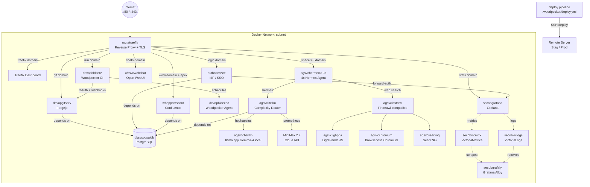

# ServiceHub

> A quiet harbor where HomeLab services arrive, find their place, and don't get lost again

ServiceHub is a self-hosted HomeLab services platform built on Docker Compose. It provides a curated stack of infrastructure, developer tools, an AI agent platform and an observability stack behind a single Traefik reverse proxy with automatic TLS — deployable to staging or production via a one-click Woodpecker CI workflow.

## Table of Contents

- [Architecture Overview](#architecture-overview)
- [Project Structure](#project-structure)
- [Core Services](#core-services)
- [DevOps Stack](#devops-stack)
- [LLM Inference Services](#llm-inference-services)
    - [Chat Inference — agsvcchatllm](#chat-inference--agsvcchatllm)
    - [LiteLLM Proxy — agsvclitellm](#litellm-proxy--agsvclitellm)
- [Web Applications](#web-applications)
    - [Authentik (Identity Provider)](#authentik-identity-provider)
    - [Homepage](#homepage)
    - [Hermes Agent](#hermes-agent)
    - [Open WebUI](#open-webui)
    - [FastCRW Web Search](#fastcrw-web-search)
- [Security Observability Stack](#security-observability-stack)
    - [VictoriaMetrics](#victoriametrics)
    - [VictoriaLogs](#victorialogs)
    - [Grafana Alloy](#grafana-alloy)
    - [Grafana](#grafana)
- [Prerequisites](#prerequisites)
- [Installation](#installation)
- [Managing Encrypted Files (git-crypt)](#managing-encrypted-files-git-crypt)
- [Deployment (Woodpecker CI)](#deployment-woodpecker-ci)
- [Usage](#usage)
- [Configuration](#configuration)

---

## Architecture Overview

All traffic enters through Traefik on ports 80/443. HTTP is redirected to HTTPS. Traefik routes requests to the appropriate service by hostname and terminates TLS using either Let's Encrypt (production) or a self-signed certificate (staging). All services communicate over an isolated Docker bridge network (`subnet`). Databases are not exposed outside the network.

Compose files are split by functional domain. Open WebUI retains the service name `wbsvcwebchat` in `compose/agent.yml`:

| File | Prefix | Purpose |
|---|---|---|
| `compose/route.yml` | `route*` | Edge routing + TLS termination (Traefik) |
| `compose/dbsvc.yml` | `dbsvc*` | Relational databases (MariaDB + PostgreSQL) |
| `compose/authn.yml` | `authn*` | Authentication / SSO (Authentik) |
| `compose/wbapp.yml` | `wbapp*` | Homepage / CMS: Confluence (`wbappcmsconf`) |
| `compose/agent.yml` | `agsvc*` | AI agents + LLM inference + web search + Open WebUI |
| `compose/devop.yml` | `devop*` | Source control + CI (Forgejo + Woodpecker) |
| `compose/secob.yml` | `secob*` | Security observability (metrics + logs + Grafana) |


```mermaid
graph TD
    Internet((Internet\n:80 / :443))
    Internet --> Traefik

    subgraph subnet[Docker Network: subnet]
        Traefik[routetraefik\nReverse Proxy + TLS]
        Traefik -->|traefik.domain| Dashboard[Traefik Dashboard]
        Traefik -->|login.domain| Authentik[authnservice\nIdP / SSO]
        Traefik -->|git.domain| Forgejo[devopgitserv\nForgejo]
        Traefik -->|run.domain| Woodpecker[devopbldserv\nWoodpecker CI]
        Traefik -->|www.domain + apex| Confluence[wbappcmsconf\nConfluence]
        Traefik -->|chats.domain| OpenWebUI[wbsvcwebchat\nOpen WebUI]
        Traefik -->|space0-3.domain| Hermes[agsvcherme00-03\n4x Hermes Agent]
        Traefik -->|stats.domain| Grafana[secobgrafana\nGrafana]
        Authentik -->|forward-auth| Grafana
        Forgejo -->|depends on| PostgreSQL[(dbsvcpgsqldb\nPostgreSQL)]
        Authentik -->|depends on| PostgreSQL
        Confluence -->|depends on| PostgreSQL
        Woodpecker -->|OAuth + webhooks| Forgejo
        Woodpecker -->|schedules| Agent[devopbldexec\nWoodpecker Agent]
        Hermes -->|hermes| LiteLLM[agsvclitellm\nComplexity Router]
        LiteLLM -->|depends on| PostgreSQL
        LiteLLM -->|hephaestus| Gemma[agsvcchatllm\nllama.cpp Gemma-4 local]
        LiteLLM -->|prometheus| MiniMax[MiniMax 2.7\nCloud API]
        Hermes -->|web search| FastCRW[agsvcfastcrw\nFirecrawl-compatible]
        FastCRW --> LightPanda[agsvclighpda\nLightPanda JS]
        FastCRW --> Chromium[agsvcchromum\nBrowserless Chromium]
        FastCRW --> SearXNG[agsvcsearxng\nSearXNG]
        Grafana -.->|metrics| VM[secobvicmtrx\nVictoriaMetrics]
        Grafana -.->|logs| VL[secobviclogs\nVictoriaLogs]
        VM -.->|scrapes| Alloy[secobgrafaly\nGrafana Alloy]
        VL -.->|receives| Alloy
    end

    WPDeploy[deploy pipeline\n.woodpecker/deploy.yml] -->|SSH deploy| RemoteServer[Remote Server\nStag / Prod]
```

**TLS strategy:**
- **Staging:** self-signed certificate from `shared/traefik/advanced/selfsigncert/` (git-crypt encrypted, referenced by `shared/traefik/advanced/certificates.yml`)
- **Production:** Let's Encrypt ACME TLS challenge; `acme.json` is stored at `${APPS_DATA}/certs/acme.json` and restored from an encrypted Woodpecker secret on deploy

---

## Project Structure

```
servicehub/
├── .woodpecker/
│   └── deploy.yml               # Woodpecker CI deployment workflow
├── compose/                    # Per-domain Docker Compose files
│   ├── route.yml               # Traefik (routetraefik)
│   ├── dbsvc.yml               # MariaDB + PostgreSQL
│   ├── authn.yml               # Authentik server + worker + init
│   ├── wbapp.yml               # Homepage / CMS (Confluence)
│   ├── agent.yml               # Hermes agents + LiteLLM + llama.cpp + Open WebUI + FastCRW
│   ├── devop.yml               # Forgejo + Woodpecker CI server/agent
│   └── secob.yml               # Security observability stack
├── shared/                     # Shared build contexts and static config
│   ├── traefik/
│   │   ├── README.md                     # Traefik service documentation
│   │   ├── Dockerfile
│   │   └── advanced/
│   │       ├── certificates.yml          # Self-signed TLS config (staging)
│   │       ├── middlewares-authentik.yml # Authentik forward-auth middleware
│   │       ├── metrics.yml               # Traefik Prometheus metrics config
│   │       └── selfsigncert/             # git-crypt encrypted cert/key material
│   ├── authentik/
│   │   ├── README.md                     # Authentik service documentation
│   │   └── Dockerfile
│   ├── forgejo/
│   │   ├── README.md                     # Forgejo service documentation
│   │   └── server/
│   │       └── Dockerfile
│   ├── woodpecker/
│   │   ├── README.md                     # Woodpecker CI service documentation
│   │   ├── server/
│   │   │   └── Dockerfile
│   │   └── agent/
│   │       └── Dockerfile
│   ├── confluence/
│   │   ├── README.md           # Confluence service documentation
│   │   ├── Dockerfile
│   │   └── plugins/
│   ├── hermesagent/
│   │   ├── Dockerfile
│   │   ├── start-gateways.sh   # Entrypoint: seeds defaults, starts gateway + workspace
│   │   ├── apply-overlay.sh    # Replays persisted /opt/hermes edits at startup
│   │   ├── overlay-*           # Overlay tooling (track / save / patch)
│   │   └── default/            # Default profile files baked into the image
│   ├── litellm/
│   │   ├── Dockerfile
│   │   ├── config.default.yaml # LiteLLM routing config (baked into image)
│   │   ├── smartrouter.py      # Content-based routing hook (privacy + complexity)
│   │   └── entrypoint.sh
│   ├── llamacpp/
│   │   ├── Dockerfile
│   │   └── entrypoint.sh       # Reads LLAMA_* env vars
│   ├── openwebui/
│   │   └── Dockerfile
│   ├── fastcrw/                # Firecrawl-compatible crawler / search
│   │   ├── Dockerfile
│   │   ├── config.docker.toml
│   │   ├── entrypoint.sh
│   │   ├── chromium/           # Browserless stealth renderer
│   │   └── lightpanda/         # LightPanda JS renderer
│   ├── searxng/                # SearXNG search backend
│   ├── grafana/
│   │   ├── Dockerfile
│   │   ├── alloy/              # Grafana Alloy config (host/container metrics + logs)
│   │   ├── dashboards/         # Pre-built observability dashboards
│   │   ├── geoip/              # GeoIP database for log enrichment
│   │   └── provisioning/       # Grafana datasources + dashboard provisioning
│   ├── victoriametrics/
│   │   ├── Dockerfile
│   │   └── scrape.yaml         # Metrics scrape configuration
│   ├── victorialogs/
│   │   └── Dockerfile
│   ├── mariadb/
│   │   ├── README.md                     # MariaDB service documentation
│   │   ├── Dockerfile
│   │   └── create-multiple-databases.sh
│   └── postgresql/
│       ├── README.md                     # PostgreSQL service documentation
│       ├── Dockerfile
│       └── create-multiple-databases.sh
├── scripts/
│   └── setup.sh                 # Local setup, env merge and secret encoding helper
├── docker-compose.yml          # Main entry point (includes all compose/ files)
├── env.example                 # Environment variable template
└── LICENSE
```

---

## Core Services

| Service | Runs as | Full documentation |
|---|---|---|
| Traefik v3 — edge router + TLS termination | `routetraefik` | [shared/traefik/README.md](shared/traefik/README.md) |
| MariaDB 11.8 — MySQL-compatible database | `dbsvcmariadb` | [shared/mariadb/README.md](shared/mariadb/README.md) |
| PostgreSQL 16 — primary database | `dbsvcpgsqldb` | [shared/postgresql/README.md](shared/postgresql/README.md) |

> Service-specific configuration, data layout, first-boot steps and operations notes live in each service's own `README.md` under `shared/`.

---

## DevOps Stack

| Service | Runs as | Full documentation |
|---|---|---|
| Forgejo — self-hosted Git service | `devopgitserv` | [shared/forgejo/README.md](shared/forgejo/README.md) |
| Woodpecker CI — server + agent | `devopbldserv`, `devopbldexec` | [shared/woodpecker/README.md](shared/woodpecker/README.md) |

Setup, configuration, OAuth, agent registration and operations are documented in the service READMEs. Woodpecker also deploys ServiceHub itself — see [Deployment (Woodpecker CI)](#deployment-woodpecker-ci).

---

## LLM Inference Services

Local and cloud LLM services power the Hermes AI agents. The llama.cpp server provides fast, private on-device inference; LiteLLM acts as a unified API gateway and complexity router between local and cloud providers.

Models are auto-downloaded on first start via the `-hf` flag and cached locally. A `HF_TOKEN` is required for gated models.

### Chat Inference — agsvcchatllm

[llama.cpp server](https://github.com/ggerganov/llama.cpp) with a Gemma 4 GGUF model for fast, private, on-device chat. This is the local tier in LiteLLM (`hephaestus`) — used for quick tasks, creative writing, translation, local RAG on private documents, and anything that must not leave the host.

| Detail | Value |
|---|---|
| Port | 12386 |
| Model | `unsloth/gemma-4-E4B-it-GGUF:Q4_K_M` (default, via `LLAMA_CHTMDL`) |
| Context | Configurable via `LLAMA_CHTARG` (default `--ctx-size 65536`, 64K) |
| Concurrent slots | `--parallel 4` (default) |
| Memory | `--mlock` + `IPC_LOCK`/unlimited memlock so the model stays in RAM |
| LiteLLM alias | `hephaestus` (env prefix `LITEM_EDGE_*`) |

### LiteLLM Proxy — agsvclitellm

[LiteLLM](https://github.com/BerriAI/litellm) is a unified LLM proxy and complexity router. All Hermes agent requests are sent to the `hermes` virtual model; `smartrouter.py` rewrites each request to either `hephaestus` (local Gemma) or `prometheus` (MiniMax) before the API call is made.

| Detail | Value |
|---|---|
| Admin UI | `http://<host>:12380/ui` |
| Database | PostgreSQL (`${LITEM_DBNAME}`) |
| Local tier | `hephaestus` → `agsvcchatllm` (Gemma-4, via `LITEM_HPH_*`) |
| Cloud tier | `prometheus` → MiniMax 2.7 (via `LITEM_PRM_*`) |
| Health check | `GET /health/liveliness` with Bearer token |
| Metrics | Prometheus `/metrics` on the UI port (scraped by VictoriaMetrics) |

**Routing logic** (first match wins):

| Signal | Destination |
|---|---|
| `[cloud]` or `[c]` prefix in message | prometheus — explicit user override |
| `[edge]` or `[e]` prefix in message | hephaestus — explicit user override |
| Local tier unhealthy | prometheus — auto-failover |
| Privacy keywords (`IEP`, `tax return`, `bank statement`, `medical record`, etc.) | hephaestus — data never leaves the host |
| Input > 50K tokens (~200 pages) | prometheus — large-document workload |
| Complexity keywords (root cause, system architecture, academic essay, curriculum map, etc.) | prometheus — formal / logic-heavy task |
| Default | hephaestus |

The explicit tags are stripped from the message before forwarding so the model never sees the routing instruction. `context_window_fallbacks` in `config.default.yaml` provides an additional safety net: any request that overflows the local model's context window is automatically escalated to prometheus (MiniMax). Provider-failure `fallbacks` route each tier to the other on timeout or error.

---

## Web Applications

### Authentik (Identity Provider)

[Authentik](https://goauthentik.io/) is the open-source Identity Provider (IdP) and SSO server: `authnservice` (web) and `authnworkers` (background), with a one-shot `authnsvrinit` permission fixer. It provides forward-authentication for Traefik-protected services such as Grafana and is reachable at `https://${AUTHN_DOMAIN}`.

Full setup, configuration and operations: **[shared/authentik/README.md](shared/authentik/README.md)**.

### Homepage

[`compose/wbapp.yml`](compose/wbapp.yml) runs **Confluence Data Center** as the homepage / CMS. It serves `WBHOME_DOMAIN` (default `www.${DOMAIN_NAME}`) and the apex `${DOMAIN_NAME}` through Traefik, backed by PostgreSQL (`${WBHOME_DBNAME}`).

| Service | Runs as | Database | Persistent data | Full documentation |
|---|---|---|---|---|
| Confluence Data Center (`WBCONF_TAG=10.2`) | `wbappcmsconf` | PostgreSQL: `${WBHOME_DBNAME}` | `${APPS_DATA}/webapps/confluence` | [shared/confluence/README.md](shared/confluence/README.md) |

Database lists only initialize **empty** database data directories. Updating `PGRSQL_DBLIST` or `MARIADB_DB_LIST` does not create databases or change credentials in an existing installation; provision any missing database and grants explicitly without resetting existing data.

### Hermes Agent

[Hermes Agent](https://hermes-agent.nousresearch.com) is a self-hosted AI agent platform by Nous Research. The workspace/gateway runs as **four isolated containers**, one per user (`agsvcherme00` … `agsvcherme03`), each under tini for correct signal forwarding.

| Detail | Value |
|---|---|
| Workspace ports | 12320 / 12321 / 12322 / 12323 (web UI, login with `HERMES_WORKSPACE_PASSWD_0X`) |
| Gateway API port | 12330 (internal, used by Open WebUI / HTTP clients) |
| Data persistence | `${HERMES_DATA_0X}` (default `${APPS_DATA}/hermesagent/0X`, mounted as `/opt/data` and set as `$HOME`) |
| Overlay | `${HERMES_DATA_0X}/overlay/` — persist edits to `/opt/hermes` across container recreation (see [shared/hermesagent/README.md](shared/hermesagent/README.md)) |
| LLM backend | LiteLLM proxy via `model: hermes` |
| Web search | FastCRW (Firecrawl-compatible) + SearXNG |
| Terminal sandbox | Docker (`/var/run/docker.sock` mounted read-only) |

A shared one-shot container (`agsvchermint`) chowns all four data directories to UID/GID `10000` before the agents start.

**Profiles:** Each container supports internal user profiles (code, research, etc.) via `hermes profile create`. These are separate from the per-container isolation and require no messaging-platform configuration.

**LLM routing from Hermes:** All requests use `model: hermes`. The LiteLLM proxy automatically routes to hephaestus (local Gemma) or prometheus (MiniMax 2.7) based on content. Users can override by prefixing their message:

```
[cloud] write a grant proposal for the school...   → prometheus / MiniMax 2.7
[c] debug this system architecture...              → prometheus / MiniMax 2.7 (shorthand)
[edge] summarise my tax return                    → hephaestus / Gemma (stays private)
[e] translate this paragraph                       → hephaestus / Gemma (shorthand)
```

> **Overlay system:** `/opt/hermes` ships read-only with the image. The overlay tools (`overlay-track`, `overlay-save`, `overlay-patch`) persist source edits on the host and replay them at container start via `apply-overlay.sh`.

### Open WebUI

[Open WebUI](https://docs.openwebui.com/) is a web-based interface for interacting with Large Language Models (LLMs). It runs as `wbsvcwebchat`.

| Detail | Value |
|---|---|
| URL | `https://${OWEBUI_DOMAIN}` |
| Internal port | 8080 |
| Data persistence | `${APPS_DATA}/openwebui` |

### FastCRW Web Search

[FastCRW](shared/fastcrw/README.md) is a self-hosted, Firecrawl-compatible crawler and search service in Rust, running as `agsvcfastcrw`. It backs Hermes' `web.backend: firecrawl` tool loop.

| Detail | Value |
|---|---|
| Internal port | 12360 |
| API key | `FIRECRAWL_API_KEY` (defaults to `${LITEM_API_KEY}`) |
| JS renderers | `agsvclighpda` (LightPanda, port 12362) and `agsvcchromum` (Browserless Chromium, port 12363) |
| Search backend | `agsvcsearxng` (SearXNG, port 12361) |
| Hermes URL | `FCRW_API_URL` (default `http://agsvcfastcrw:12360`) |

---

## Security Observability Stack

A full metrics and log observability stack built on Grafana, VictoriaMetrics, VictoriaLogs, and Grafana Alloy.


```mermaid
graph LR
    subgraph Collectors[Collection]
        Alloy[secobgrafaly\nHost + Container + Traefik]
    end
    subgraph Storage[Storage]
        VM[secobvicmtrx\nTime-series metrics]
        VL[secobviclogs\nLog aggregation]
    end
    subgraph Visualization[Visualization]
        Grafana[secobgrafana\nDashboards]
    end
    Alloy -->|metrics push| VM
    Alloy -->|logs push| VL
    Grafana -->|query| VM
    Grafana -->|query| VL
```

### VictoriaMetrics

[VictoriaMetrics](https://victoriametrics.com/products/open-source/) is a fast, cost-effective time-series database for Prometheus-format metrics.

| Detail | Value |
|---|---|
| HTTP API port | 8428 (published to host for remote Alloy/metrics push) |
| Data persistence | `${APPS_DATA}/victoriametrics` |
| Scrape targets | Grafana Alloy (secobgrafaly:9080) and LiteLLM (agsvclitellm:12380/metrics) |
| Health check | `curl` on port 8428 every 30 s |

### VictoriaLogs

[VictoriaLogs](https://victoriametrics.com/products/victorialogs/) is a lightweight log aggregation system with a simple query interface.

| Detail | Value |
|---|---|
| HTTP API port | 9428 (published to host for remote Alloy/log push) |
| Data persistence | `${APPS_DATA}/victorialogs` |
| Log source | Grafana Alloy (Docker logs, container stats, Traefik access logs) |
| Health check | `curl` on port 9428 every 30 s |

### Grafana Alloy

[Grafana Alloy](https://grafana.com/docs/alloy/) is a telemetry collector that gathers host metrics, container metrics, and logs. It runs as `secobgrafaly`.

| Detail | Value |
|---|---|
| HTTP API port | 9080 (internal only) |
| Collectors | unix_exporter (CPU, memory, disk, network), cAdvisor (containers), Loki (logs) |
| Data sources | Docker socket, containerd socket, procfs, sysfs, cgroupfs |
| Scrape target | `routetraefik:8080` — Traefik Prometheus metrics |
| Depends on | VictoriaMetrics, VictoriaLogs (healthy) |

> **Privileged access:** The Alloy container runs in privileged mode (`--privileged`) because cAdvisor requires access to the host's `/proc`, `/sys`, and Docker socket to collect container metrics.

### Grafana

[Grafana](https://grafana.com/) provides dashboards for visualizing metrics and logs, running as `secobgrafana`.

| Detail | Value |
|---|---|
| URL | `https://${SECOB_DOMAIN}` |
| Database | SQLite (embedded, persisted to `${APPS_DATA}/grafana`) |
| Data sources | VictoriaMetrics (metrics), VictoriaLogs (logs) |
| Auth | Authentik forward-auth (`authentik-forwardauth@file`) |
| Dashboards | Node Exporter Full, Docker Dashboard, cAdvisor Explorer, Traefik Dashboard, VictoriaLogs Explorer, and more |
| Plugins | `victoriametrics-logs-datasource` |

---

## Prerequisites

- **Docker** 24+ with **Compose 2.20+** (`docker compose` or standalone `docker-compose` v2) for `include` support
- **python3** 3.8+ (required by `scripts/setup.sh`)
- **Git** 2.x
- **git-crypt** (macOS: `brew install git-crypt`) — required to encrypt/decrypt self-signed certificates stored in the repo. The remote deploy server installs it automatically via the workflow.
- A domain name with DNS A records pointing to your server (for Let's Encrypt) **or** a local domain with a self-signed certificate (for staging)
- A Linux server with SSH access (for remote deployment)
- `openssl` (used by `setup.sh` to generate database passwords)

---

## Installation

### 1. Clone the Repository

```bash
git clone https://github.com/yongxinL/servicehub.git
cd servicehub
```

### 2. Initial Setup

Run the setup script to create your `.env` from the template. It auto-generates strong passwords and API keys for all services:

```bash
bash scripts/setup.sh
```

If `.env` already exists (e.g., after pulling updates), the script merges new variables from `env.example` without overwriting existing values.

### 3. Configure Environment Variables

Edit `.env` to match your environment:

```bash
# Required — set these before first start
DOMAIN_NAME=example.com          # Your primary domain
TRAEFIK_DOMAIN=traefik.example.com
AUTHN_DOMAIN=login.example.com   # Authentik hostname
GITREPO_DOMAIN=git.example.com   # Forgejo hostname
GITBLD_DOMAIN=run.example.com    # Woodpecker CI hostname
TRAEFIK_ACMEMAIL=you@example.com # Let's Encrypt registration email
APPS_DATA=~/Documents/containerd # Default host path for persistent data
TIME_ZONE=Australia/Sydney
WBHOME_DOMAIN=www.${DOMAIN_NAME}
WBHOME_DBNAME=svchubwbhome
WBCONF_TAG=10.2
```

See [Configuration](#configuration) for the variable reference. For an existing installation, retain database names and credentials rather than copying new-install defaults.

### 4. Prepare TLS

For **production** (Let's Encrypt), Traefik creates `${APPS_DATA}/certs/acme.json` automatically on the first successful certificate issuance — no manual step is needed. Verify its permissions are restricted after it is created (Traefik refuses to use a world-readable file):

```bash
chmod 600 ${APPS_DATA}/certs/acme.json
```

For **staging** (self-signed), place your `.pem` and `.key` files in `shared/traefik/advanced/selfsigncert/` matching `shared/traefik/advanced/certificates.yml`. These are encrypted with git-crypt before committing. No `acme.json` is needed.

For remote deployments via the Woodpecker CI workflow, `acme.json` is restored automatically from the `*_B64ENC_ACME` secret (gzip+base64 encoded via `setup.sh --encode`) with `600` permissions. The restore only overwrites the existing file if the secret is newer, preserving certificates renewed by Traefik since the last encode.

### 5. Prepare Data Directories

Service init containers (`authnsvrinit`, `devopbldinit`, `agsvchermint`, `secobgrafint`) fix ownership on every boot. To prepare directories ahead of time:

```bash
mkdir -p ${APPS_DATA}/databases/{mariadb,pgsqldb}
mkdir -p ${APPS_DATA}/webapps/authentik/{media,templates}
mkdir -p ${APPS_DATA}/certs
mkdir -p ${APPS_DATA}/devops/{repos,buildserv,buildexec}
mkdir -p ${APPS_DATA}/hermesagent/{00,01,02,03}
chown -R 1000:1000 ${APPS_DATA}/devops
```

Replace `${APPS_DATA}` with the actual path you set in `.env` (default: `~/Documents/containerd`). Homepage data lives under `${APPS_DATA}/webapps/confluence`; follow the service README for directory ownership.

### 6. Start the Stack

Start the base services and the default homepage (Confluence).

```bash
docker compose up -d
```

Or start a specific service:

```bash
docker compose up -d devopgitserv
```

---

## Managing Encrypted Files (git-crypt)

Self-signed certificates for staging are stored **encrypted** in `shared/traefik/advanced/selfsigncert/` using [git-crypt](https://github.com/AGWA/git-crypt). They appear as binary blobs to anyone without the key, making it safe to commit them. The deploy workflow decrypts them automatically on the remote server.

### One-time Setup (new repository)

```bash
# 1. Initialise git-crypt in the repo (only needed once)
git-crypt init

# 2. Export the symmetric key — back this up securely (password manager, etc.)
#    Losing this key means losing access to all encrypted files permanently.
git-crypt export-key ./servicehub.key

# 3. Verify .gitattributes is present (already included in this repo)
cat .gitattributes
```

`.gitattributes` encrypts every certificate file under the self-signed cert directory:

```
shared/traefik/advanced/selfsigncert/*.pem filter=git-crypt diff=git-crypt
shared/traefik/advanced/selfsigncert/*.key filter=git-crypt diff=git-crypt
shared/traefik/advanced/selfsigncert/*.crt filter=git-crypt diff=git-crypt
shared/traefik/advanced/selfsigncert/*.pfx filter=git-crypt diff=git-crypt
```

### Add Your Staging Certificates

Place your self-signed files in `shared/traefik/advanced/selfsigncert/` matching the names in `shared/traefik/advanced/certificates.yml`, then commit normally:

```bash
cp /path/to/selfcert.pem    shared/traefik/advanced/selfsigncert/
cp /path/to/selfcert.key    shared/traefik/advanced/selfsigncert/
cp /path/to/selfcertCA.crt  shared/traefik/advanced/selfsigncert/
git add shared/traefik/advanced/selfsigncert/
git commit -m "add staging self-signed certificates (encrypted)"
```

git-crypt encrypts the files transparently on commit. Verify with:
```bash
# Should print non-text (encrypted) output — not your cert content
git show HEAD:shared/traefik/advanced/selfsigncert/selfcert.pem | file -
```

### Encode the Key for Woodpecker

The deploy workflow needs the key as a Woodpecker secret:

```bash
# Encode the binary key as base64
base64 -w0 servicehub.key
```

Copy the output into Woodpecker → Repository → Settings → Secrets as **`GIT_CRYPT_KEY`**.

### Unlock on a New Machine

```bash
git-crypt unlock ./servicehub.key
```

---

## Deployment (Woodpecker CI)

The Woodpecker CI workflow at [.woodpecker/deploy.yml](.woodpecker/deploy.yml) provides a one-click deployment to staging or production over SSH. All deploy logic is inline in the workflow, which runs in the stack's own Woodpecker instance (`devopbldexec`). Deploying **all** services or a **single** service works the same as before — leave the deploy task empty for all services, or name one compose service (see [Triggering a Deployment](#triggering-a-deployment)).

The workflow triggers on two events:

| Event | Behaviour |
|---|---|
| `manual` (Run pipeline) | Deploys the selected branch to **staging** (`stag`), all services |
| `deployment` (Deploy button) | Deploys to the chosen **deploy target** (`stag` or `prod`) and, optionally, a single compose service as the **deploy task** |

### How It Works

1. Selects the `STAG_*` or `PROD_*` secrets from the deploy target (`CI_PIPELINE_DEPLOY_TARGET`), defaulting to staging for manual runs
2. Configures SSH known hosts from a stored secret (or falls back to `ssh-keyscan`)
3. On the remote server: clones the repo on first deploy, or pulls the branch on subsequent runs
4. Installs git-crypt on the remote server if needed, then decrypts encrypted files (e.g. staging certs)
5. Restores `.env` from the `*_B64ENC_ENVS` secret if the secret is newer than the existing file
6. Runs `scripts/setup.sh` to merge any new variables from `env.example` into `.env`
7. Restores `acme.json` from the `*_B64ENC_ACME` secret if the secret is newer than the existing file
8. Runs `docker compose up --build -d [service]` on the remote

> **Timestamp-based restore:** Both `.env` and `acme.json` are gzip-compressed before base64-encoding, which preserves the file's original mtime in the gzip header. On deploy, the workflow compares that mtime against the existing file on the server — the newer file always wins. This prevents a stale secret from overwriting a `.env` edited directly on the server or an `acme.json` renewed by Traefik since the last encode.

### Encoding Secrets for Woodpecker

Before triggering the workflow, encode your local `.env` and `acme.json` into Woodpecker secrets using the helper:

```bash
# For staging
bash scripts/setup.sh --encode STAG

# For production
bash scripts/setup.sh --encode PROD
```

The script outputs `.b64` files and prints instructions for copying their content into Woodpecker secrets.

### Required Woodpecker Secrets

Set these in **Woodpecker → Repository → Settings → Secrets**.

> **Secret events:** each secret must be enabled for the **`manual`** and **`deployment`** events (the defaults only cover `push`, `tag`, `release` and `deployment`). Add `manual` to every secret, or Run pipeline will fail. Woodpecker also fails the pipeline when a referenced secret is missing, so create **all** secrets listed below — leave unused ones empty.

#### Shared (both environments)

| Secret | How to obtain | Description |
|---|---|---|
| `GITREPO_DEPLOY_TOKEN` | Forgejo → Settings → Applications → Access Token (repo read scope) | Forgejo access token used by the deploy step to clone/pull the repository on the remote server. |
| `GIT_CRYPT_KEY` | `base64 -i servicehub.key \| tr -d '\n'` | Base64-encoded git-crypt symmetric key used to decrypt self-signed certificates on the remote server after git clone/pull. Generate with `git-crypt init && git-crypt export-key ./servicehub.key`. |

#### Staging (`STAG_*`)

| Secret | Example value | Description |
|---|---|---|
| `STAG_SERVER_HOST` | `192.168.1.10` or `stag.example.com` | IP address or hostname of the staging server. Used for SSH connection. |
| `STAG_SERVER_USER` | `deploy` | SSH login username on the staging server. |
| `STAG_SERVER_PASS` | `••••••••` | SSH password for the above user. |
| `STAG_DEPLOY_PATH` | `/home/username/servicehub` | Absolute path on the staging server where the repo is cloned. Must include the repo directory name — git clones **into** this path. |
| `STAG_B64ENC_ENVS` | *(output of `setup.sh --encode STAG`)* | Gzip+base64-encoded `.env` file. Restored on deploy only if the secret is newer than the existing `.env` on the server. |
| `STAG_B64ENC_ACME` | *(leave the value empty for staging)* | Gzip+base64-encoded `acme.json` (Let's Encrypt certificates). For staging, create the secret with an **empty value** — Traefik uses the self-signed cert from `shared/traefik/advanced/selfsigncert/` instead. The secret must exist so Woodpecker can resolve it. |
| `STAG_SSHKWN_KEYS` | *(output of `ssh-keyscan <host>`)* | The staging server's public SSH host key. Prevents man-in-the-middle attacks by verifying the server identity before connecting. **Optional** — if unset the deploy script falls back to `ssh-keyscan` at runtime with a warning. |

#### Production (`PROD_*`)

| Secret | Example value | Description |
|---|---|---|
| `PROD_SERVER_HOST` | `203.0.113.10` or `prod.example.com` | IP address or hostname of the production server. |
| `PROD_SERVER_USER` | `deploy` | SSH login username on the production server. |
| `PROD_SERVER_PASS` | `••••••••` | SSH password for the above user. |
| `PROD_DEPLOY_PATH` | `/home/username/servicehub` | Absolute path on the production server where the repo is cloned. |
| `PROD_B64ENC_ENVS` | *(output of `setup.sh --encode PROD`)* | Gzip+base64-encoded production `.env`. Restored on deploy only if the secret is newer than the existing `.env` on the server. |
| `PROD_B64ENC_ACME` | *(output of `setup.sh --encode PROD`)* | Gzip+base64-encoded `acme.json` containing your Let's Encrypt certificates. Generated by `setup.sh --encode PROD` when `acme.json` is larger than 1 KB (i.e. after Traefik has issued real certificates). Restored only if the secret is newer than the existing file. |
| `PROD_SSHKWN_KEYS` | *(output of `ssh-keyscan <host>`)* | The production server's public SSH host key. Strongly recommended for production. Run `ssh-keyscan <prod-host>` locally to get the value. |

### Triggering a Deployment

1. Open the repository in Woodpecker (`https://${GITBLD_DOMAIN}`) → **Pipelines**
2. For **staging**: click **Run pipeline** on the `main` branch (or on a branch you want to deploy) — the `manual` event deploys all services to staging
3. For **staging or production**: open a recent successful pipeline and click **Deploy** — set the **environment** to the deploy target (`stag` or `prod`) and, optionally, the **task** to a single compose service (`routetraefik`, `dbsvcmariadb`, `dbsvcpgsqldb`, `authnservice`, `authnworkers`, `devopgitserv`, `devopbldserv`, `devopbldexec`, `wbappcmsconf`, `agsvclitellm`, `agsvcchatllm`, `agsvcfastcrw`, `agsvclighpda`, `agsvcchromum`, `agsvcsearxng`, `agsvcherme00`–`agsvcherme03`, `secobvicmtrx`, `secobviclogs`, `secobgrafaly`, or `secobgrafana`); leave the task empty to deploy **all** services

---

## Usage

### Start / Stop Services

```bash
# Start all services
docker compose up -d

# Stop all services
docker compose down

# Restart a single service
docker compose restart devopgitserv

# View logs
docker compose logs -f devopgitserv
```

### Rebuild After a Config Change

```bash
docker compose up -d --build devopgitserv
```

### Update All Images

```bash
docker compose pull && docker compose up -d
```

---

## Configuration

All settings are controlled via `.env`. The template [`env.example`](env.example) documents every variable. Key sections:

> Services with a dedicated README ([Traefik](shared/traefik/README.md), [Authentik](shared/authentik/README.md), [MariaDB](shared/mariadb/README.md), [PostgreSQL](shared/postgresql/README.md), [Forgejo](shared/forgejo/README.md), [Woodpecker CI](shared/woodpecker/README.md), [Confluence](shared/confluence/README.md)) also document their own variables there.

### General

| Variable | Default | Description |
|---|---|---|
| `TIME_ZONE` | `Australia/Sydney` | Container timezone |
| `APPS_DATA` | `~/Documents/containerd` | Host path for all persistent data |

### Domain & Network

| Variable | Description |
|---|---|
| `DOMAIN_NAME` | Primary domain (e.g. `example.com`) |
| `TRUSTED_IP` | CIDR ranges Traefik trusts for forwarded headers |

### TLS / Traefik (route)

| Variable | Description |
|---|---|
| `TRAEFIK_DOMAIN` | Traefik dashboard hostname |
| `TRAEFIK_ACMEMAIL` | Let's Encrypt registration email |
| `TRAEFIK_BAAUTH` | Dashboard basic-auth credentials (htpasswd format) |
| `CERTRESOLVER` | Set to `letsencrypt` for ACME; leave empty for self-signed |

### Authentik (authn)

| Variable | Description |
|---|---|
| `AUTHN_TAG` | Authentik image tag (e.g. `2026.8`) |
| `AUTHN_DOMAIN` | Authentik hostname (e.g. `login.example.com`) |
| `AUTHN_DBNAME` | PostgreSQL database name for Authentik (default: `svchubauthtk`) |
| `AUTHN_PASSWD` | Auto-generated by `setup.sh`; Authentik DB password |
| `AUTHN_SECRET` | Auto-generated by `setup.sh`; Authentik secret key |

### Homepage

| Variable | Description |
|---|---|
| `WBHOME_DOMAIN` | Shared homepage hostname (default: `www.${DOMAIN_NAME}`); both alternatives also serve the apex |
| `WBHOME_DBNAME` | Homepage database name (default: `svchubwbhome`) |
| `WBCONF_TAG` | Confluence image tag (default: `10.2`) |

### Hermes Agent

| Variable | Default | Description |
|---|---|---|
| `HERMES_WORKSPACE_PASSWD_00`…`_03` | Auto-generated | Passwords for the Hermes Workspace web UI per container (ports 12320–12323) |
| `HERMES_DATA_00`…`_03` | `${APPS_DATA}/hermesagent/0X` | Per-container data directories |
| `HERMES_WORKSPACE_DOMAIN_00`…`_03` | `spaceX.${DOMAIN_NAME}` | Optional Traefik domains for HTTPS access (empty = IP:port only) |
| `LITEM_API_KEY` | Auto-generated | Passed as `LITELLM_API_KEY`/`API_SERVER_KEY` to Hermes for authenticating with the LiteLLM proxy |
| `FCRW_API_URL` | `http://agsvcfastcrw:12360` | FastCRW base URL used by Hermes web search |

### LiteLLM Proxy

| Variable | Default | Description |
|---|---|---|
| `LITEM_API_KEY` | Auto-generated by `setup.sh` | Master API key (Bearer token format `sk-...`). Used by Hermes, FastCRW and other services. |
| `LITEM_API_URL` | `http://agsvclitellm:12380/v1` | Base URL clients use to reach the proxy |
| `LITEM_ADMUSR` | `admin` | Admin UI username for the LiteLLM dashboard |
| `LITEM_ADMPWD` | | Admin UI password |
| `LITEM_DBNAME` | `litellm` | PostgreSQL database name for LiteLLM usage tracking |
| `LITEM_HPH_APIURL` | `http://agsvcchatllm:12386/v1` | Local (hephaestus) inference base URL |
| `LITEM_HPH_APIKEY` | `none` | Local inference API key |
| `LITEM_HPH_HLTURL` | `http://agsvcchatllm:12386/health` | Local inference health-check URL |
| `LITEM_PRM_APIBASE` | `https://api.minimax.io/anthropic` | MiniMax Anthropic-compatible API base URL (prometheus tier) |
| `LITEM_PRM_APIKEY` | | MiniMax API key |

### LLM Inference (llama.cpp)

| Variable | Default | Description |
|---|---|---|
| `LLAMA_CHTMDL` | `unsloth/gemma-4-E4B-it-GGUF:Q4_K_M` | Chat inference model (hephaestus tier). Auto-downloaded from HuggingFace on first start. |
| `LLAMA_CHTARG` | *(see env.example)* | Additional llama.cpp server flags (context size, threads, batching, etc.) |
| `HF_TOKEN` | *(empty)* | HuggingFace token — required for gated models |

### Open WebUI

| Variable | Description |
|---|---|
| `OWEBUI_DOMAIN` | Open WebUI hostname (e.g. `chats.example.com`) |

### Grafana (Security Observability)

| Variable | Description |
|---|---|
| `SECOB_DOMAIN` | Grafana hostname (e.g. `stats.example.com`) |
| `SECOB_ADMUSR` | Grafana admin username |
| `SECOB_ADMPWD` | Grafana admin password |

### Databases

| Variable | Description |
|---|---|
| `SQLDB_USER` | Shared DB username for both MariaDB and PostgreSQL |
| `SQLDB_PASS` | Auto-generated by `setup.sh`; store securely |
| `MySQL_HOST` / `MySQL_PORT` | MariaDB hostname / port (internal) |
| `PGRSQL_HOST` / `PGRSQL_PORT` | PostgreSQL hostname / port (internal) |
| `MARIADB_DB_LIST` | Comma-separated MariaDB databases to initialize (default: `${WBHOME_DBNAME}`) |
| `PGRSQL_DBLIST` | Comma-separated PostgreSQL databases to initialize, including `${LITEM_DBNAME}` |

For new installations:

```bash
MARIADB_DB_LIST="${WBHOME_DBNAME}"
PGRSQL_DBLIST="${AUTHN_DBNAME},${GITREPO_DBNAME},${LITEM_DBNAME},${WBHOME_DBNAME}"
```

These lists only initialize empty database data directories. Preserve existing database names and passwords; create missing databases and grants explicitly on existing installations. See the [PostgreSQL](shared/postgresql/README.md) and [MariaDB](shared/mariadb/README.md) READMEs.

### Email (SMTP)

| Variable | Description |
|---|---|
| `SMTP_HOST` | SMTP server hostname |
| `SMTP_PORT` | SMTP port |
| `SMTP_USER` / `SMTP_PASS` | SMTP credentials |
| `SMTP_FROM` | From address for outbound email (display name + address) |

---

## License

GNU General Public License v3.0 — see [LICENSE](LICENSE) for details.
