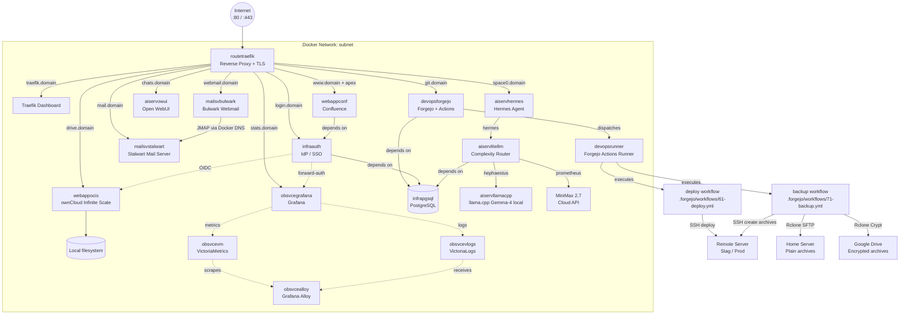
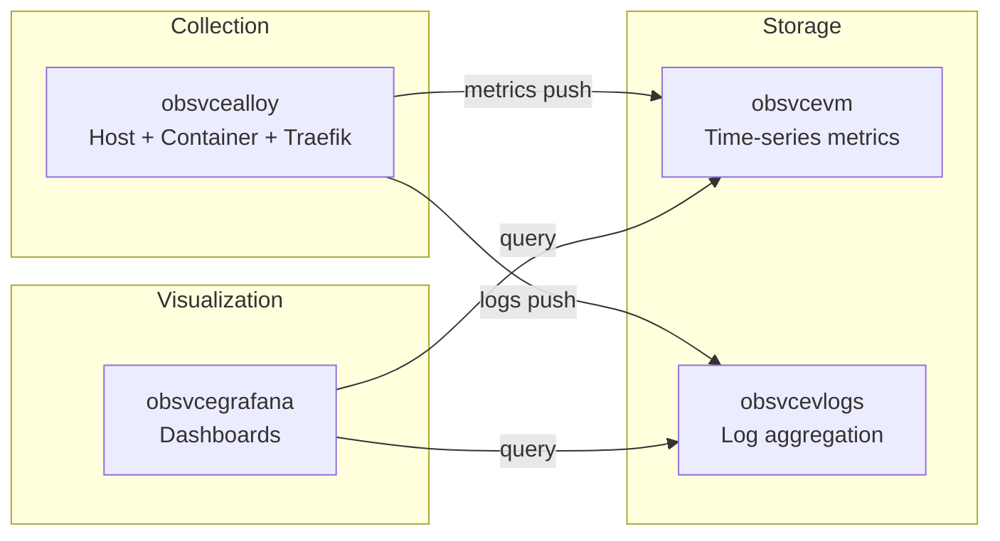

# ServiceHub

> A quiet harbor where HomeLab services arrive, find their place, and don't get lost again

ServiceHub is a self-hosted HomeLab services platform built on Docker Compose. It provides a curated stack of infrastructure, developer tools, an AI agent platform and an observability stack behind a single Traefik reverse proxy with automatic TLS — deployable to staging or production via a one-click Forgejo Actions workflow.

## Table of Contents

- [Architecture Overview](#architecture-overview)
- [Project Structure](#project-structure)
- [Core Services](#core-services)
- [DevOps (Source Control + CI)](#devops-source-control--ci)
- [AI Agent Platform (aiserv)](#ai-agent-platform-aiserv)
- [Web Applications](#web-applications)
- [Observability Stack (obsvce)](#observability-stack-obsvce)
- [Email Stack (mailsv)](#email-stack-mailsv)
- [Getting Started](#getting-started)
- [Usage](#usage)
- [Configuration](#configuration)
- [License](#license)

---

## Documentation

Repository-backed project documentation is authoritative:

- [Documentation home](docs/README.md)
- [Architecture](docs/architecture/ARCHITECTURE.md)
- [Architecture decisions](docs/adr/README.md)
- [RFCs](docs/rfc/README.md)
- [Development phases](docs/phases/README.md)
- [Operations](docs/operations/README.md)
- [Releases](docs/releases/README.md)

Use the [documentation home](docs/README.md) for requirements, testing, investigations, lessons, and templates. The Forgejo Wiki and Confluence are not sources of truth.

---

## Architecture Overview

All traffic enters through Traefik on ports 80/443. HTTP is redirected to HTTPS. Traefik routes requests to the appropriate service by hostname and terminates TLS using either Let's Encrypt (production) or a self-signed certificate (staging). All services communicate over an isolated Docker bridge network (`subnet`); Confluence's outbound traffic is further restricted to private destinations by a host firewall rule ([ADR-009 §5](docs/adr/ADR-009-rescope-oci-deployment-and-harden-platform-boundaries.md)). Databases are not exposed outside the network.

Compose files are split by functional domain:

| File | Prefix | Purpose |
|---|---|---|
| `compose/route.yml` | `route*` | Edge routing + TLS termination (Traefik) |
| `compose/infra.yml` | `infra*` | Relational databases (MariaDB + PostgreSQL) |
| `compose/infra.yml` | `infra*` | Authentication / SSO (Authentik) |
| `compose/devops.yml` | `devops*` | Source control, CI, and backups (Forgejo plus its Actions runner) |
| `compose/webapp.yml` | `webapp*` | Homepage / CMS (Confluence) and oCIS cloud drive |
| `compose/aiserv.yml` | `aiserv*` | AI platform (Open WebUI + Hermes + LiteLLM + llama.cpp) — hosted on local infrastructure, not deployed to OCI ([ADR-009](docs/adr/ADR-009-rescope-oci-deployment-and-harden-platform-boundaries.md)) |
| `compose/obsvce.yml` | `obsvce*` | Observability (metrics + logs + Grafana) — retained in the repository, not deployed to OCI ([ADR-009](docs/adr/ADR-009-rescope-oci-deployment-and-harden-platform-boundaries.md)) |
| `compose/mailsv.yml` | `mailsv*` | Email services (Stalwart mail server + Bulwark webmail) |


```mermaid
graph TD
    Internet((Internet\n:80 / :443))
    Internet --> Traefik

    subgraph subnet[Docker Network: subnet]
        Traefik[routetraefik\nReverse Proxy + TLS]
        Traefik -->|traefik.domain| Dashboard[Traefik Dashboard]
        Traefik -->|login.domain| Authentik[infraauth\nIdP / SSO]
        Traefik -->|git.domain| Forgejo[devopsforgejo\nForgejo + Actions]
        Traefik -->|www.domain + apex| Confluence[webappconf\nConfluence]
        Traefik -->|chats.domain| OpenWebUI[aiservowui\nOpen WebUI]
        Traefik -->|drive.domain| Cloud[webappocis\nownCloud Infinite Scale]
        Traefik -->|space0.domain| Hermes[aiservhermes\nHermes Agent]
        Traefik -->|stats.domain| Grafana[obsvcegrafana\nGrafana]
        Traefik -->|mail.domain| Stalwart[mailsvstalwart\nStalwart Mail Server]
        Traefik -->|webmail.domain| Bulwark[mailsvbulwark\nBulwark Webmail]
        Bulwark -->|JMAP via Docker DNS| Stalwart
        Authentik -.->|forward-auth| Grafana
        Authentik -.->|OIDC| Cloud
        Cloud --> CloudData[(Local filesystem)]
        Forgejo -->|depends on| PostgreSQL[(infrapgsql\nPostgreSQL)]
        Authentik -->|depends on| PostgreSQL
        Confluence -->|depends on| Authentik
        Forgejo -->|dispatches| Runner[devopsrunner\nForgejo Actions Runner]
        Hermes -->|hermes| LiteLLM[aiservlitellm\nComplexity Router]
        LiteLLM -->|depends on| PostgreSQL
        LiteLLM -->|hephaestus| Gemma[aiservllamacpp\nllama.cpp Gemma-4 local]
        LiteLLM -->|prometheus| MiniMax[MiniMax 2.7\nCloud API]
        Grafana -.->|metrics| VM[obsvcevm\nVictoriaMetrics]
        Grafana -.->|logs| VL[obsvcevlogs\nVictoriaLogs]
        VM -.->|scrapes| Alloy[obsvcealloy\nGrafana Alloy]
        VL -.->|receives| Alloy
    end

    Runner -->|executes| WPDeploy[deploy workflow\n.forgejo/workflows/61-deploy.yml]
    Runner -->|executes| BackupFlow[backup workflow\n.forgejo/workflows/71-backup.yml]
    WPDeploy -->|SSH deploy| RemoteServer[Remote Server\nStag / Prod]
    BackupFlow -->|SSH create archives| RemoteServer
    BackupFlow -->|Rclone SFTP| Home[Home Server\nPlain archives]
    BackupFlow -->|Rclone Crypt| Drive[Google Drive\nEncrypted archives]
```

**TLS strategy:**
- **Staging:** self-signed certificate from `shared/traefik/advanced/selfsigncert/` (git-crypt encrypted, referenced by `shared/traefik/advanced/certificates.yml`)
- **Production:** Let's Encrypt ACME TLS challenge; `acme.json` is stored at `${APPS_DATA}/shared/certs/acme.json` and restored from an encrypted Actions secret on deploy

---

## Project Structure

```
servicehub/
├── .forgejo/
│   └── workflows/
│       ├── 61-deploy.yml                 # Forgejo Actions deployment workflow (self-contained)
│       └── 71-backup.yml                 # Dual-target backup creation, transfer, integrity, and retention workflow
├── compose/                    # Per-domain Docker Compose files
│   ├── route.yml               # Traefik (routetraefik)
│   ├── infra.yml               # MariaDB + PostgreSQL
│   ├── infra.yml               # Authentik server + worker + init
│   ├── webapp.yml               # Confluence + oCIS cloud drive
│   ├── aiserv.yml               # Open WebUI + Hermes agents + LiteLLM + llama.cpp
│   ├── devops.yml               # Forgejo + Forgejo Actions runner
│   ├── obsvce.yml               # Observability stack (VictoriaMetrics + VictoriaLogs + Grafana), not deployed to OCI
│   └── mailsv.yml               # Email services (Stalwart mail server + Bulwark webmail)
├── shared/                     # Shared build contexts and static config
│   ├── traefik/
│   │   ├── README.md                     # Traefik service documentation
│   │   ├── Dockerfile
│   │   └── advanced/
│   │       ├── certificates.yml          # Self-signed TLS config (staging)
│   │       ├── middlewares-authentik.yml # Authentik forward-auth middleware
│   │       ├── metrics.yml               # Traefik Prometheus metrics config
│   │       └── selfsigncert/             # git-crypt encrypted cert/key material
│   ├── authentik/
│   │   ├── README.md                     # Authentik service documentation
│   │   └── Dockerfile
│   ├── forgejo/
│   │   ├── README.md                     # Forgejo service + Actions runner documentation
│   │   ├── server/Dockerfile             # Forgejo server image
│   │   └── actions/Dockerfile            # Forgejo Actions runner image
│   ├── confluence/
│   │   ├── README.md                     # Confluence service documentation
│   │   ├── Dockerfile
│   │   └── plugins/
│   ├── hermesagent/
│   │   ├── README.md                     # Hermes Agent documentation
│   │   ├── Dockerfile
│   │   ├── start-gateways.sh             # Entrypoint: seeds defaults, starts gateway + workspace
│   │   ├── init-profile.sh               # One-shot profile seeder (run on first container exec)
│   │   ├── apply-overlay.sh              # Replays persisted /opt/hermes edits at startup
│   │   ├── overlay-*                     # Overlay tooling (track / save / patch)
│   │   └── default/                      # Default profile files baked into the image
│   ├── litellm/
│   │   ├── README.md                     # LiteLLM service documentation
│   │   ├── Dockerfile
│   │   ├── config.default.yaml           # LiteLLM routing config (baked into image)
│   │   ├── smartrouter.py                # Content-based routing hook (privacy + complexity)
│   │   └── entrypoint.sh
│   ├── llamacpp/
│   │   ├── README.md                     # llama.cpp chat inference documentation
│   │   ├── Dockerfile
│   │   └── entrypoint.sh                 # Reads LLAMA_* env vars
│   ├── openwebui/
│   │   ├── README.md                     # Open WebUI service documentation
│   │   └── Dockerfile
│   ├── owncloud/
│   │   ├── README.md                     # ownCloud Infinite Scale documentation
│   │   ├── Dockerfile                    # webappocis image build
│   │   └── entrypoint.sh                 # oCIS init and server startup
│   ├── fastcrw/                          # Optional web-search stack (not included by default)
│   │   ├── README.md                     # FastCRW + renderers + SearXNG documentation
│   │   ├── Dockerfile                    # aiservfastcrw image build
│   │   ├── compose.yml                   # aiservfastcrw
│   │   ├── config.docker.toml
│   │   ├── entrypoint.sh
│   │   ├── chromium/                     # aiservchromum — browserless stealth renderer
│   │   │   ├── compose.yml
│   │   │   └── Dockerfile
│   │   └── lightpanda/                   # aiservlighpda — LightPanda JS renderer
│   │       ├── compose.yml
│   │       └── Dockerfile
│   ├── searxng/                          # Optional search backend
│   │   ├── compose.yml                   # aiservsearxng
│   │   └── Dockerfile
│   ├── grafana/
│   │   ├── README.md                     # Grafana service documentation
│   │   ├── Dockerfile
│   │   ├── alloy/                        # Grafana Alloy config + README
│   │   ├── dashboards/                   # Pre-built observability dashboards
│   │   ├── geoip/                        # GeoIP database for log enrichment
│   │   └── provisioning/                 # Grafana datasources + dashboard provisioning
│   ├── victoriametrics/
│   │   ├── README.md                     # VictoriaMetrics documentation
│   │   ├── Dockerfile
│   │   └── scrape.yaml                   # Metrics scrape configuration
│   ├── victorialogs/
│   │   ├── README.md                     # VictoriaLogs documentation
│   │   └── Dockerfile
│   ├── mariadb/
│   │   ├── README.md                     # MariaDB service documentation
│   │   ├── Dockerfile
│   │   └── create-multiple-databases.sh
│   ├── postgresql/
│   │   ├── README.md                     # PostgreSQL service documentation
│   │   ├── Dockerfile
│   │   └── create-multiple-databases.sh
│   ├── stalwart/                          # Stalwart Mail Server (mailsvstalwart)
│   │   ├── README.md                      # Stalwart service documentation
│   │   ├── Dockerfile
│   │   ├── config.json                    # Stalwart PostgreSQL DataStore template (rendered at container start)
│   │   ├── entrypoint.sh                  # Bootstrap cert + privilege drop
│   │   └── acme-export.sh                 # Extracts certs from Traefik's acme.json
│   ├── bulwark/                           # Bulwark Webmail (mailsvbulwark)
│   │   ├── README.md                      # Bulwark service documentation
│   │   └── Dockerfile
│   └── wordpress/                        # Optional alternative homepage (not included by default)
│       ├── README.md
│       ├── compose.yml
│       └── ...
├── scripts/
│   └── setup.sh                 # Local setup, env merge and secret encoding helper
├── docker-compose.yml          # Main entry point (includes all compose/ files)
├── env.example                 # Environment variable template
└── LICENSE
```

---

## Core Services

| Service | Runs as | Full documentation |
|---|---|---|
| Traefik v3 — edge router + TLS termination | `routetraefik` | [docs/products/traefik.md](docs/products/traefik.md) |
| MariaDB 11.8 — MySQL-compatible database | `inframariadb` | [docs/products/mariadb.md](docs/products/mariadb.md) |
| PostgreSQL 16 — primary database | `infrapgsql` | [docs/products/postgresql.md](docs/products/postgresql.md) |

> Service-specific configuration, data layout, first-boot steps and operations notes live in each service's own `README.md` under `shared/`.

---

## DevOps (Source Control + CI)

| Service | Runs as | Full documentation |
|---|---|---|
| Forgejo — self-hosted Git service + Actions | `devopsforgejo`, `devopsrunner` | [docs/products/forgejo.md](docs/products/forgejo.md) |

Setup, configuration, Actions runner registration and operations are documented in the service README. Forgejo Actions also deploys the application services (databases, Authentik, Forgejo and Traefik are foundational and deployed manually) — see [Deployment (Forgejo Actions)](docs/operations/DEPLOYMENT.md).

---

## AI Agent Platform (aiserv)

Local and cloud LLM services power the Hermes AI agents. The llama.cpp server provides fast, private on-device inference; LiteLLM acts as a unified API gateway and complexity router between local and cloud providers. All AI services live in [`compose/aiserv.yml`](compose/aiserv.yml). Per [ADR-009](docs/adr/ADR-009-rescope-oci-deployment-and-harden-platform-boundaries.md) the AI platform runs on local infrastructure and is excluded from the OCI deployment.

| Service | Runs as | Full documentation |
|---|---|---|
| Open WebUI — AI platform chat interface | `aiservowui` | [docs/products/openwebui.md](docs/products/openwebui.md) |
| Hermes Agent — single shared agent workspace + gateway | `aiservhermes` (+ one-shot `aiservhermesinit`) | [docs/products/hermesagent.md](docs/products/hermesagent.md) |
| LiteLLM Proxy — unified API gateway + complexity router | `aiservlitellm` | [docs/products/litellm.md](docs/products/litellm.md) |
| llama.cpp chat inference — local Gemma tier | `aiservllamacpp` | [docs/products/llamacpp.md](docs/products/llamacpp.md) |

**At a glance:**

| Detail | Value |
|---|---|
| Hermes workspace port | 12320 (login with `HERMES_WORKSPACE_PASSWD_00`) |
| Hermes gateway API port | 12330 (internal) |
| LiteLLM admin UI | `http://<host>:12380/ui` |
| Local model | Gemma 4 GGUF on llama.cpp (`hephaestus`) |
| Cloud model | MiniMax 2.7 (`prometheus`) |

**LLM routing from Hermes:** all agent requests use `model: hermes`; the LiteLLM proxy routes to hephaestus (local Gemma) or prometheus (MiniMax 2.7) based on message content. Users can override by prefixing their message:

```
[cloud] write a grant proposal for the school...   → prometheus / MiniMax 2.7
[c] debug this system architecture...              → prometheus / MiniMax 2.7 (shorthand)
[edge] summarise my tax return                    → hephaestus / Gemma (stays private)
[e] translate this paragraph                       → hephaestus / Gemma (shorthand)
```

See [docs/products/litellm.md](docs/products/litellm.md#routing-logic) for the full routing rules, and [docs/products/hermesagent.md](docs/products/hermesagent.md) for the workspace, overlay system and profiles.

### Multi-user & scaling

Hermes Agent is **single-user / single-tenant**: one container serves exactly one login and one agent identity. Everything under a Hermes home — sessions, `MEMORY.md`, `USER.md`, skills and `state.db` — is shared by anyone logged into that container. Upstream is explicit that profiles are *configuration, not a person* and that profile multiplexing "does not authenticate or authorize end users". See [docs/products/hermesagent.md](docs/products/hermesagent.md#multi-user-support) for the full findings.

The stack therefore ships **one** Hermes Agent (`aiservhermes`) that acts as a shared team assistant. When more people need their **own** private agent, add another isolated container rather than sharing one login. To scale to N users, replicate the `aiservhermes` pattern in [`compose/aiserv.yml`](compose/aiserv.yml):

1. **Add a data volume + init entry** — extend `aiservhermesinit` with `/data0X`, or add a sibling init container, pointing at `${APPS_DATA}/aiserv/hermes/0X`.
2. **Duplicate the `aiservhermes` service** as `aiservhermes0X`, with:
   - its own `${HERMES_DATA_0X}:/opt/data` volume,
   - its own `HERMES_WORKSPACE_PASSWD_0X` and (optionally) `HERMES_WORKSPACE_DOMAIN_0X`,
   - a unique host port (`1232X:12320`).
3. **Add the matching `HERMES_WORKSPACE_PASSWD_0X`, `HERMES_DATA_0X` and `HERMES_WORKSPACE_DOMAIN_0X`** variables to `.env` / [`env.example`](env.example).
4. **Recreate** with `docker compose up -d --build aiservhermes0X`.

All agents share the same `aiservlitellm` router and `aiservllamacpp` model, so GPU/RAM scaling is handled centrally there — only per-user data and the workspace need duplicating. For identity-aware routing you can front the agents with Authentik and map each user to a container, but do **not** point multiple people at a single Hermes login.

---

## Web Applications

| Service | Runs as | Full documentation |
|---|---|---|
| Authentik — IdP / SSO | `infraauth`, `infraauthwrk` (+ one-shot `infraauthinit`) | [docs/products/authentik.md](docs/products/authentik.md) |
| Confluence Data Center — homepage / CMS | `webappconf` | [docs/products/confluence.md](docs/products/confluence.md) |
| ownCloud Infinite Scale — family cloud drive | `webappocis` (+ one-shot `webappocisinit`) | [docs/products/owncloud.md](docs/products/owncloud.md) |

Confluence serves `WORKSPACE_DOMAIN` (default `www.${DOMAIN_NAME}`) and the apex `${DOMAIN_NAME}` through Traefik, backed by PostgreSQL (`${WORKSPACE_DBNAME}`). Open WebUI (AI platform, `compose/aiserv.yml`) is served at `https://${CHAT_DOMAIN}`. oCIS is served at `https://${CLOUD_DOMAIN}`, authenticates through Authentik OIDC, and uses local filesystem paths without a dedicated PostgreSQL database.

> **Database lists only initialize empty data directories.** Updating `POSTGRES_DATABASES` or `MARIADB_DATABASES` does not create databases or change credentials in an existing installation; provision any missing database and grants explicitly without resetting existing data.
>
> An optional [WordPress homepage](docs/products/wordpress.md) can replace Confluence; the two must never run together.

---

## Observability Stack (obsvce)

A full metrics and log observability stack built on Grafana, VictoriaMetrics, VictoriaLogs, and Grafana Alloy. All components live in [`compose/obsvce.yml`](compose/obsvce.yml). Per [ADR-009](docs/adr/ADR-009-rescope-oci-deployment-and-harden-platform-boundaries.md) this stack is retained in the repository but is not deployed to OCI; [ADR-010](docs/adr/ADR-010-collect-oci-logs-and-integrate-with-oracle-apm.md) records the Oracle Cloud APM, Monitoring, and Logging replacement for OCI-hosted workloads, which is not yet configured.

| Component | Runs as | Full documentation |
|---|---|---|
| VictoriaMetrics — time-series metrics store | `obsvcevm` | [docs/products/victoriametrics.md](docs/products/victoriametrics.md) |
| VictoriaLogs — log aggregation | `obsvcevlogs` | [docs/products/victorialogs.md](docs/products/victorialogs.md) |
| Grafana Alloy — host/container/metrics/log collector | `obsvcealloy` | [shared/grafana/alloy/README.md](shared/grafana/alloy/README.md) |
| Grafana — dashboards for metrics and logs | `obsvcegrafana` (+ one-shot `obsvcegrafanainit`) | [docs/products/grafana.md](docs/products/grafana.md) |


```mermaid
graph LR
    subgraph Collectors[Collection]
        Alloy[obsvcealloy\nHost + Container + Traefik]
    end
    subgraph Storage[Storage]
        VM[obsvcevm\nTime-series metrics]
        VL[obsvcevlogs\nLog aggregation]
    end
    subgraph Visualization[Visualization]
        Grafana[obsvcegrafana\nDashboards]
    end
    Alloy -->|metrics push| VM
    Alloy -->|logs push| VL
    Grafana -->|query| VM
    Grafana -->|query| VL
```

Grafana is reachable at `https://${OBSERVABILITY_DOMAIN}` behind Authentik forward-auth and ships pre-built dashboards for node, Docker/cAdvisor, Traefik, VictoriaMetrics, LiteLLM and VictoriaLogs.

---

## Email Stack (mailsv)

A self-hosted email stack: [Stalwart](https://github.com/stalwartlabs/stalwart) provides SMTP, IMAP and JMAP in one server; [Bulwark](https://github.com/bulwarkmail/webmail) provides the JMAP webmail UI. All services live in [`compose/mailsv.yml`](compose/mailsv.yml).

| Service | Runs as | Full documentation |
|---|---|---|
| Stalwart Mail Server — SMTP / IMAP / JMAP + web admin | `mailsvstalwart` | [docs/products/stalwart.md](docs/products/stalwart.md) |
| Bulwark Webmail — JMAP webmail client | `mailsvbulwark` | [docs/products/bulwark.md](docs/products/bulwark.md) |

**At a glance:**

| Detail | Value |
|---|---|
| Mail server (Stalwart admin) | `https://${EMAIL_HOST}` — reachable from trusted IPs only |
| Webmail (Bulwark) | `https://${POSTOFFICE_DOMAIN}` |
| Ports published to the host | 25 / 465 / 587 / 993 (SMTP server-to-server, submission ×2, IMAP) |
| Storage | PostgreSQL (`${POSTOFFICE_DBNAME}` on `infrapgsql`) holds all mail data — accounts, messages, indexes, blobs |
| TLS | Reused from Traefik's shared `acme.json` via an in-container certificate exporter |
| Webmail → Stalwart | JMAP at `https://${EMAIL_HOST}` — browser-side, so Stalwart needs **Permissive CORS** (`usePermissiveCors`) and a trusted certificate (see [Bulwark — Login prerequisites](docs/products/bulwark.md#login-prerequisites-stalwart-side)) |
| Single sign-on | Authentik serves the directory: webmail users log in with their Authentik password through the JMAP password form, IMAP/SMTP/JMAP logins bind against Authentik's LDAP outpost |

The SMTP/IMAP ports are reachable directly (bypassing Traefik); DNS `MX`/`A` records for `${EMAIL_HOST}` must point at the host. Other stack components send mail through Stalwart using the `EMAIL_*` variables documented in [Configuration](#configuration). Accounts come from Authentik over LDAP for every path — webmail, IMAP, SMTP, JMAP (webmail OIDC SSO is not used; it requires an OIDC-backed Stalwart directory — see [Bulwark — SSO/OIDC](docs/products/bulwark.md#sso--oidc-not-used)) — setup walkthrough in the [Stalwart README](docs/products/stalwart.md#initial-provisioning-walkthrough), with the full [Authentik LDAP directory setup](docs/products/stalwart.md#directory-authentik-ldap-sso) (provider, service account, outpost) documented there as well.

---

## Getting Started

New here? The full setup sequence — prerequisites, clone, initial `scripts/setup.sh` run, environment configuration, TLS preparation, data directories, and first stack start — lives in [Installation](docs/operations/INSTALLATION.md) under Operations.

Staging certificates are encrypted with git-crypt; the one-time setup, key backup, and daily workflow for that live in [Managing Encrypted Files (git-crypt)](docs/operations/DEVELOPMENT.md#managing-encrypted-files-git-crypt) under Development.

One-click staging/production deployment runs through the stack's own Forgejo Actions runner; its inputs, secrets and variables are documented in [Deployment (Forgejo Actions)](docs/operations/DEPLOYMENT.md), and the backup workflow (archives, schedules, retention, `BACKUP_*` secrets) in [Backup and restore](docs/operations/BACKUP-RESTORE.md), both under Operations.

---

## Usage

### Security baseline

Every inbound route is fronted by Traefik with the `secure-chain` middleware — security headers (HSTS, nosniff, referrer policy) and a per-client-IP rate limit (20 req/s, burst 50) — defined in [`shared/traefik/advanced/middlewares-security.yml`](shared/traefik/advanced/middlewares-security.yml) and documented in [Traefik — Security middlewares](docs/products/traefik.md#security-middlewares). Admin surfaces (Traefik dashboard, Stalwart admin) additionally carry IP allowlists built from `TRUSTED_IP` and Host rules built from `TRAEFIK_DOMAIN` / `EMAIL_HOST` / `IDENTITY_DOMAIN` (themselves `${DOMAIN_NAME}` references), generated into [`shared/traefik/advanced/admin-routers.yml`](shared/traefik/advanced/admin-routers.yml) and hot-reloaded by Traefik — edit `.env` (including `DOMAIN_NAME`), re-run `scripts/setup.sh`, no restart. Per-service hardening steps (Authentik MFA, Confluence anonymous access, Forgejo registration/OIDC, Stalwart auto-ban, Bulwark dashboard) live in each service's README under **Security hardening**.

### Start / Stop Services

```bash
# Start all services
docker compose up -d

# Stop all services
docker compose down

# Restart a single service
docker compose restart devopsforgejo

# View logs
docker compose logs -f devopsforgejo
```

### Rebuild After a Config Change

```bash
docker compose up -d --build devopsforgejo
```

### Update All Images

```bash
docker compose pull && docker compose up -d
```

---

## Configuration

All settings are controlled via `.env`. The template [`env.example`](env.example) documents every variable. Key sections:

> Services with a dedicated README ([Traefik](docs/products/traefik.md), [Authentik](docs/products/authentik.md), [MariaDB](docs/products/mariadb.md), [PostgreSQL](docs/products/postgresql.md), [Forgejo + Actions](docs/products/forgejo.md), [Confluence](docs/products/confluence.md), [oCIS](docs/products/owncloud.md), [Hermes Agent](docs/products/hermesagent.md), [LiteLLM](docs/products/litellm.md), [llama.cpp](docs/products/llamacpp.md), [Open WebUI](docs/products/openwebui.md), [VictoriaMetrics](docs/products/victoriametrics.md), [VictoriaLogs](docs/products/victorialogs.md), [Grafana](docs/products/grafana.md), [Stalwart](docs/products/stalwart.md), [Bulwark](docs/products/bulwark.md)) also document their own variables there.

### General

| Variable | Default | Description |
|---|---|---|
| `TIME_ZONE` | `Australia/Sydney` | Container timezone |
| `APPS_DATA` | `~/Documents/containerd` | Host path for all persistent data |

### Domain & Network

| Variable | Description |
|---|---|
| `DOMAIN_NAME` | Primary domain (e.g. `example.com`); the derived hosts (`TRAEFIK_DOMAIN`, `EMAIL_HOST`, `IDENTITY_DOMAIN`, …) reference it as `${DOMAIN_NAME}`, and re-running `scripts/setup.sh` after changing it regenerates `admin-routers.yml` with the new Host rules |
| `TRUSTED_IP` | CIDR ranges for forwarded-header trust and the admin allow lists (re-run `scripts/setup.sh` after changing to regenerate `admin-routers.yml`) |

### TLS / Traefik (route)

| Variable | Description |
|---|---|
| `TRAEFIK_DOMAIN` | Traefik dashboard hostname (default: `traefik.${DOMAIN_NAME}`); one of the hosts generated into `admin-routers.yml` |
| `TRAEFIK_ACMEMAIL` | Let's Encrypt registration email |
| `TRAEFIK_BAAUTH` | Dashboard basic-auth credentials (htpasswd format) |
| `CERTRESOLVER` | Set to `letsencrypt` for ACME; leave empty for self-signed |

### Authentik (infra)

| Variable | Description |
|---|---|
| `IDENTITY_TAG` | Authentik image tag (e.g. `2026.8`) |
| `IDENTITY_DOMAIN` | Authentik hostname (e.g. `login.example.com`) |
| `IDENTITY_DBNAME` | PostgreSQL database name for Authentik (default: `svchub_identity`) |
| `IDENTITY_PASSWORD` | Auto-generated by `setup.sh`; Authentik DB password |
| `IDENTITY_SECRET` | Auto-generated by `setup.sh`; Authentik secret key |

### Web Applications (webapp)

| Variable | Description |
|---|---|
| `WORKSPACE_DOMAIN` | Shared homepage hostname (default: `www.${DOMAIN_NAME}`); the apex is served as well |
| `WORKSPACE_DBNAME` | Workspace database name (default: `svchub_workspace`) |
| `WORKSPACE_TAG` | Confluence image tag (default: `10.2`) |
| `CLOUD_DOMAIN` | oCIS cloud-drive hostname (default: `drive.${DOMAIN_NAME}`) |
| `CLOUD_TAG` | Pinned oCIS image tag (default: `8.2.0`) |
| `CLOUD_OIDC_ISSUER` | Authentik OIDC issuer for the `ocis` application |
| `CLOUD_OIDC_CLIENT_ID` | Public Authentik OIDC client ID |
| `CLOUD_INSECURE` | `true` only when Authentik uses a self-signed certificate |

### AI Agent Platform (aiserv)

The agent platform variables are documented in the service READMEs — see [Hermes Agent](docs/products/hermesagent.md#configuration-in-env), [LiteLLM](docs/products/litellm.md#configuration) and [llama.cpp](docs/products/llamacpp.md#configuration). In short:

| Variable | Description |
|---|---|
| `CHAT_DOMAIN` | Open WebUI hostname (e.g. `chats.example.com`) |
| `HERMES_WORKSPACE_PASSWD_00` | Workspace web UI password (port 12320) |
| `HERMES_DATA_00` | Agent data directory (default `${APPS_DATA}/aiserv/hermes/00`) |
| `HERMES_WORKSPACE_DOMAIN_00` | Optional Traefik domain (empty = IP:port only) |
| `AIGATE_API_KEY` | LiteLLM master API key, shared by Hermes and other in-stack clients |
| `AIGATE_*` | LiteLLM proxy, admin UI and provider routing settings |
| `LLAMA_CHTMDL` / `LLAMA_CHTARG` / `HF_TOKEN` | llama.cpp model, server flags, HuggingFace token |

### Observability (obsvce)

| Variable | Description |
|---|---|
| `OBSERVABILITY_DOMAIN` | Grafana hostname (e.g. `stats.example.com`) |
| `OBSERVABILITY_ADMIN_USER` | Grafana admin username |
| `OBSERVABILITY_ADMIN_PASSWORD` | Grafana admin password |

### Databases

| Variable | Description |
|---|---|
| `DB_ADMIN_USER` | Shared DB username for both MariaDB and PostgreSQL |
| `DB_ADMIN_PASSWORD` | Auto-generated by `setup.sh`; store securely |
| `MARIADB_HOST` / `MARIADB_PORT` | MariaDB hostname / port (internal) |
| `POSTGRES_HOST` / `POSTGRES_PORT` | PostgreSQL hostname / port (internal) |
| `MARIADB_DATABASES` | Comma-separated MariaDB databases to initialize (default: `${WORKSPACE_DBNAME}`) |
| `POSTGRES_DATABASES` | Comma-separated PostgreSQL databases to initialize, including `${AIGATE_DBNAME}` |

For new installations:

```bash
MARIADB_DATABASES="${WORKSPACE_DBNAME}"
POSTGRES_DATABASES="${IDENTITY_DBNAME},${SOURCECODE_DBNAME},${AIGATE_DBNAME},${WORKSPACE_DBNAME},${POSTOFFICE_DBNAME}"
```

These lists only initialize empty database data directories. Preserve existing database names and passwords; create missing databases and grants explicitly on existing installations. See the [PostgreSQL](docs/products/postgresql.md) and [MariaDB](docs/products/mariadb.md) READMEs.

### Email (SMTP)

| Variable | Description |
|---|---|
| `EMAIL_HOST` | SMTP server hostname — also the Stalwart mail server hostname and its container hostname |
| `EMAIL_PORT` | SMTP port (465 by default, Stalwart's implicit-TLS submission port) |
| `EMAIL_USER` / `EMAIL_PASS` | SMTP credentials used by stack components to send mail through Stalwart |
| `EMAIL_FROM` | From address for outbound email (display name + address) |

### Email Services (mailsv)

The webmail variables are documented in the service READMEs — see [Bulwark](docs/products/bulwark.md#configuration-env) and [Stalwart](docs/products/stalwart.md#configuration-env). In short:

| Variable | Description |
|---|---|
| `POSTOFFICE_DOMAIN` | Bulwark hostname (must differ from `${EMAIL_HOST}`) |
| `WEBMAIL_SESSION_SECRET` | Session cookie encryption; auto-generated by `setup.sh` |
| `POSTOFFICE_DBNAME` | PostgreSQL database holding all Stalwart mail data (must be in `POSTGRES_DATABASES`) |
| `STALWART_ADMIN_USER` / `STALWART_ADMIN_PASS` | Stalwart recovery admin (`STALWART_RECOVERY_ADMIN`); pass auto-generated by `setup.sh`, empty disables |

---

## License

GNU General Public License v3.0 — see [LICENSE](LICENSE) for details.
