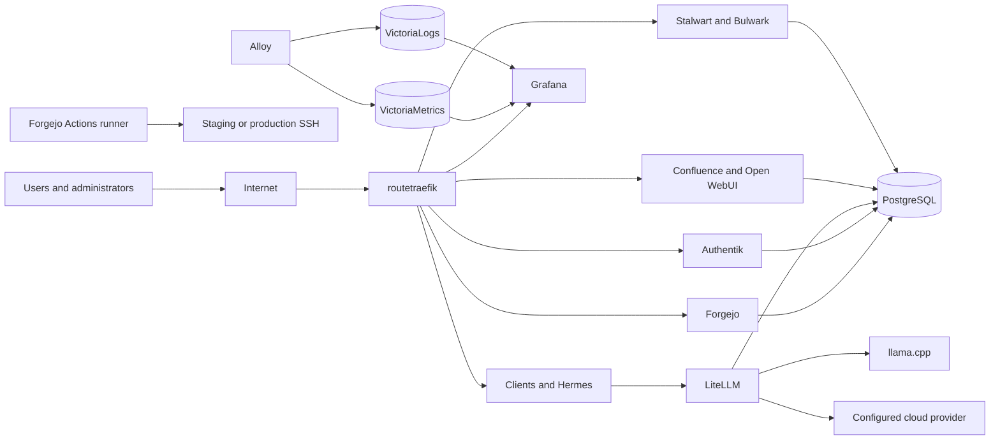

# ServiceHub Architecture

## Architecture Overview

ServiceHub is a Docker Compose project named `servicehub`. The root file includes eight domain Compose files for routing, databases, identity, developer services, web applications, AI, observability, and email. All included services join the `subnet` bridge network.

This diagram is an architectural summary, not a complete dependency graph. Exact conditions and persistence are in the [component catalogue](COMPONENT-CATALOGUE.md).

## Architecture Principles

- Keep implementation and documentation in the same repository.
- Use explicit Compose domains and stable service names.
- Use one HTTP ingress for routed web services.
- Keep databases off the public ingress.
- Prefer explicit persistence paths under `APPS_DATA`.
- Separate default services from optional add-ons.
- Prefer local AI processing for privacy-sensitive requests while retaining a configured cloud route.
- Treat privileged access, dynamic ports, and host mounts as reviewable risks.
- Record decisions in ADRs and significant alternatives in RFCs.

## Major Subsystems

| Subsystem | Compose domain | Principal services |
|---|---|---|
| Routing and TLS | `compose/route.yml` | `routetraefik` |
| Relational data | `compose/dbsvc.yml` | `dbsvcpgsqldb`, `dbsvcmariadb` |
| Identity | `compose/authn.yml` | `authnservice`, `authnworkers`, `authnsvcinit` |
| Developer services | `compose/depot.yml` | `depotservice`, `depotrunner`, `depotsvcinit` |
| Web applications | `compose/wbapp.yml` | `wbappcmshome`, `wbappwebchat` |
| AI platform | `compose/aiagn.yml` | `aiagnherm00`, `aiagnlitellm`, `aiagnchatllm`, `aiagnhermint` |
| Observability | `compose/obsvc.yml` | `obsvcgrafaly`, `obsvcvicmtrx`, `obsvcviclogs`, `obsvcgrafana`, `obsvcgrafint` |
| Email | `compose/poste.yml` | `posteservice`, `postewebmail`, `postesvcinit` |

## Security Boundaries

- **External ingress:** Traefik publishes 80 and 443 and is the designed web boundary.
- **Docker network:** Included services communicate through `servicehub_subnet`; databases publish no host ports.
- **Identity boundary:** Grafana uses Authentik forward auth. Authentik itself is application-authenticated. Other Authentik integrations vary and are not all configured in Compose.
- **Privileged boundary:** Traefik, Authentik's worker, and Alloy have Docker socket access; Alloy is privileged and mounts host filesystem paths.
- **Deployment boundary:** Forgejo runner jobs reach remote hosts over SSH using repository secrets.
- **Direct-host boundary:** Hermes, LiteLLM, llama.cpp, VictoriaMetrics, VictoriaLogs, and Stalwart publish selected host ports independent of Traefik.

These boundaries are Confirmed from configuration. Their security effectiveness requires runtime review.

## Data Platforms

- **PostgreSQL 16:** default database for Authentik, Forgejo, LiteLLM, Confluence, and Stalwart; persistent path `${APPS_DATA}/databases/pgsqldb`.
- **MariaDB 11.8:** retained for the optional WordPress service; not used by the default stack according to `env.example`.
- **VictoriaMetrics:** Prometheus-compatible metric storage under `${APPS_DATA}/victoriametrics`.
- **VictoriaLogs:** log storage under `${APPS_DATA}/victorialogs`.
- **Grafana:** dashboard and alert-rendering state under `${APPS_DATA}/grafana`.

No database-backed file-cloud service is part of the current architecture.

## Identity Architecture

Authentik runs a server, worker, and permission-initialisation service. PostgreSQL stores Authentik state; media and templates use bind mounts. The repository documents:

- Grafana Traefik forward authentication.
- Stalwart LDAP authentication through an Authentik LDAP outpost.
- Recommended Authentik delegation for Forgejo and Confluence.

The Compose files do not prove that every application integration has been configured at runtime. Identity coverage beyond Grafana and the documented Stalwart path is `Not yet verified`.

Bulwark uses a password form validated by Stalwart, not OIDC. The Traefik dashboard uses basic authentication and an IP allowlist.

## AI Architecture

Hermes calls LiteLLM using the virtual model `hermes`. LiteLLM routes to:

- `hephaestus`: local llama.cpp Gemma service by default and for privacy-sensitive content.
- `prometheus`: configured cloud provider for explicit cloud tags, large inputs, complexity signals, unhealthy local inference, and configured fallback conditions.

Open WebUI is a separate client surface. FastCRW, SearXNG, LightPanda, and Chromium are optional and excluded from the default root include.

The routing configuration is Confirmed; provider availability, privacy enforcement at runtime, and fallback outcomes are `Requires runtime validation`.

## Observability Architecture

Grafana Alloy collects host metrics, container metrics, Traefik metrics, LiteLLM metrics, Alloy metrics, and Docker container logs. It remote-writes metrics to VictoriaMetrics and pushes logs to VictoriaLogs. Grafana provisions both data sources and repository dashboards.

Grafana alerting is enabled with `render_only_panels=true`. No notification channel, severity model, ownership list, or alert test evidence is present in the repository.

## Deployment Architecture

Forgejo Actions workflows run on the host-mode `ssh-deploy` runner. Deployment SSHes to a staging or production target, updates a Git checkout, restores git-crypt and environment material when configured, and rebuilds application services with `--no-deps`. Foundational services are excluded from CI deployment.

The backup workflow SSHes separately and creates PostgreSQL dumps and a periodic `APPS_DATA` archive on the target host.

See [deployment architecture](DEPLOYMENT-ARCHITECTURE.md) for details and validation gaps.

## Persistence Architecture

The default stack uses host bind mounts rather than named Docker volumes:

- Relational data: `${APPS_DATA}/databases/...`
- Identity: `${APPS_DATA}/platform/authentik/...`
- Repositories and runner state: `${APPS_DATA}/platform/repos`, `.../buildexec`, and `.../workspace`
- Web applications: `${APPS_DATA}/webapps/confluence` and `${APPS_DATA}/openwebui`
- AI: `${APPS_DATA}/litellm`, `${APPS_DATA}/llamacpp`, and `${HERMES_DATA_00:-${APPS_DATA}/hermesagent/00}`
- Observability: `${APPS_DATA}/victoriametrics`, `.../victorialogs`, and `.../grafana`
- Email: `${APPS_DATA}/platform/mailbox` and `${APPS_DATA}/platform/webmail/...`
- Certificates: `${APPS_DATA}/certs`

Configuration files under `shared/` are mostly read-only mounts. Off-host durability and restore capability are not yet verified.

## Known Constraints

- Compose `include` requires Compose 2.20+.
- Remote deployment requires SSH credentials, repository secrets, and passwordless sudo.
- Forgejo is not deployed by CI because doing so would disrupt the runner.
- Traefik's Docker provider requires Docker socket access.
- Local inference is resource intensive and has a longer health-check start period.
- Several APIs publish host ports without a documented host firewall rule.
- Optional FastCRW and WordPress are not included by the root Compose file.

## Open Architecture Concerns

- Runtime validation of routes, TLS, identity, health, AI routing, telemetry, and backups.
- Restore procedure, off-host backup protection, RPO, and RTO.
- Alert notification, ownership, and testing.
- High-privileged container and host mount review.
- Authentik application coverage and break-glass account controls.
- Direct port exposure and network policy.
- The optional WordPress router does not declare `secure-chain` in its tracked Compose file.
- Rollback model and first governed release.
- Family file-cloud requirements and pilot decision.

Related records: [system context](SYSTEM-CONTEXT.md), [data flow](DATA-FLOW.md), [ADR register](../adr/README.md), and [baseline test plan](../testing/TEST-001-platform-baseline-validation.md).
