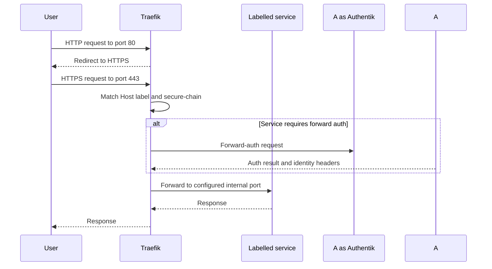
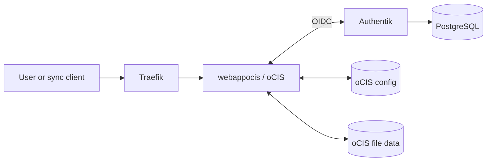
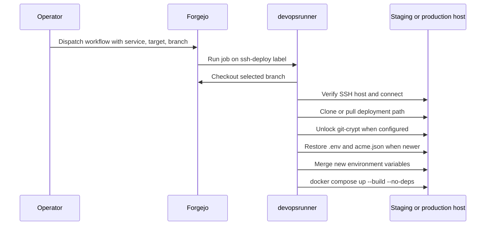
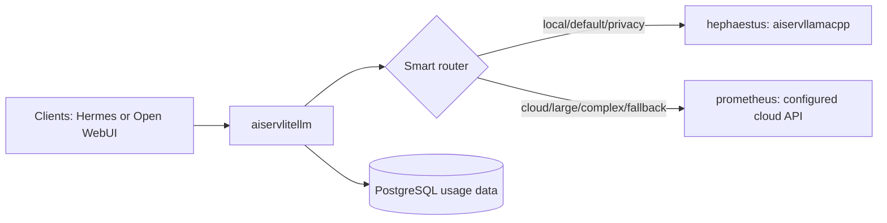
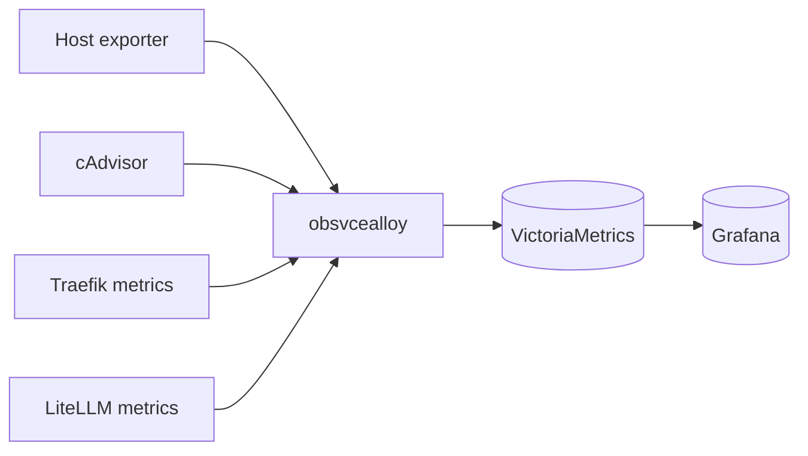
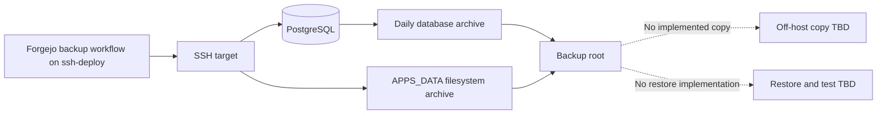
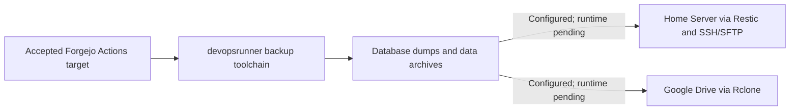

# ServiceHub Data Flow

## User Request Flow Through Traefik

Traefik uses Docker labels with `exposedbydefault=false`. The HTTP entry point redirects to `websecure`; `secure-chain` adds security headers and rate limiting. Per-router middleware may add IP allowlisting, forward auth, or compression.

Actual DNS resolution and certificate issuance are `Requires runtime validation`.

## Authentication Flow Through Authentik

Grafana's route uses `authentik-forwardauth@file`. The middleware calls the Authentik outpost endpoint and accepts identity response headers. Authentik stores state in PostgreSQL and runs a worker that may manage outposts through the Docker socket.

Stalwart uses a documented LDAP directory backed by an Authentik LDAP outpost. Bulwark presents a password form and validates it through Stalwart over JMAP. This is not an OIDC flow.

oCIS receives an OIDC authorization code flow from Authentik, uses `preferred_username` for local account provisioning, and does not use Traefik forward auth. The provider and application must exist in Authentik before sign-in can succeed. Repository configuration is present; the runtime flow is not yet validated.

Other application integrations remain recommendations or runtime configuration not proven by Compose.

## Cloud Drive Flow

The oCIS service mounts configuration and file data beneath `${APPS_DATA}/webapp/ocis`. It has no direct PostgreSQL connection; Authentik's PostgreSQL database remains the identity source.

## Forgejo Actions Deployment Flow

Foundational `infra*`, `infra*`, `devops*`, and `route*` services are excluded from CI deployment. The deployment workflow does not implement rollback.

## AI Request Routing Flow

The smart router can disable fallback for explicit tags and privacy requests. Configured context-window and provider-failure fallbacks exist in LiteLLM. Exact runtime decisions require logs from an executed test.

## Metrics Flow

VictoriaMetrics also has a direct scrape configuration for Alloy and LiteLLM. Host ports 8428 and 9428 are published for remote pushes, although remote sources are not configured in this repository.

## Log Flow

Alloy discovers Docker container logs through the Docker socket, applies GeoIP enrichment, and pushes them to VictoriaLogs. Grafana reads VictoriaLogs through the provisioned data source. No log retention or notification policy is committed.

## Database Access Flow

- Authentik, Forgejo, LiteLLM, Confluence, and Stalwart connect to `infrapgsql` through `servicehub_subnet`.
- oCIS does not connect to `infrapgsql`; its configuration and file data are filesystem state.
- MariaDB is available for optional WordPress and is not used by the default stack according to `env.example`.
- Database containers do not publish host ports.
- Database credentials and names are interpolated from `.env`; their values are not documented.

## Backup and Restore Flow

The backup workflow runs on the existing `devopsrunner` with the `ssh-deploy` label, SSHes to the remote target, discovers `APPS_DATA`, creates per-database PostgreSQL dumps and a globals dump, packs them into a daily archive, and optionally archives the full `APPS_DATA` tree. Full archives are taken on Sundays in `auto` mode.

The database archive is transaction-consistent because it uses `pg_dump`; the live filesystem archive is only crash-consistent for database directories. The created files remain under the configured backup root and are streamed or copied to both accepted targets by the same workflow.

Both `${APPS_DATA}/webapp/ocis/config` and `${APPS_DATA}/webapp/ocis/data` are in the current full-archive scope, but no oCIS-specific consistency or restore validation exists.

[ADR-007](../adr/ADR-007-adopt-dual-target-backup-and-recovery.md) accepts a target flow in which Forgejo Actions uses the existing `devopsrunner` toolchain to copy database dumps and persistent-data archives to a Home Server with Restic over SSH/SFTP and independently to Google Drive with Rclone. Repository configuration for this flow is present, but transfers and restores are not runtime-validated.

