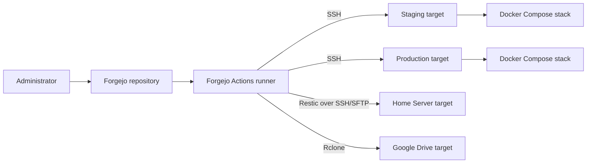

# ServiceHub System Context

## Users

- Administrators configure environment variables, services, TLS, identity, storage, workflows, backups, and monitoring.
- Developers and reviewers change Compose and shared configuration.
- End users access web, identity, source control, cloud-drive, AI, email, and dashboard services.
- Forgejo Actions operators trigger deployment, backup, and remote-access workflows.
- Coding agents retrieve documentation and inspect implementation evidence.

Named user organisations, teams, and support contacts are `TBD`.

## ServiceHub Boundary

The core boundary consists of the `servicehub` Compose project, its included domain files, the `servicehub_subnet` network, `APPS_DATA` bind mounts, repository configuration under `shared/`, and Forgejo workflows under `.forgejo/workflows/`.

Remote staging and production hosts are separate deployment targets. The Home Server and Google Drive backup targets, external DNS, certificate authorities, image registries, and AI providers are outside the platform boundary.

## Ingress

- Traefik publishes host ports 80 and 443.
- Port 80 redirects to HTTPS.
- Traefik discovers labelled containers through the Docker provider.
- Services without Traefik labels remain unrouted by Traefik.
- Selected AI and observability services publish additional host ports directly.
- Stalwart additionally publishes mail protocol ports.

## Remote Deployment Targets

The workflows recognise `stag` and `prod` targets. Hostnames, users, deploy paths, authentication material, and known-host values are repository secrets and must not be recorded here. Target reachability and current state are `Not yet verified`.

## External Systems

| External system | Interaction | Evidence state |
|---|---|---|
| DNS service | Resolves public hostnames to deployment targets | Required by repository docs; provider `TBD` |
| Let's Encrypt | ACME TLS challenge when `CERTRESOLVER=letsencrypt` | Configuration confirmed; issuance `Requires runtime validation` |
| Image registries | Supply base images and optional build downloads | Dockerfiles confirmed |
| Forgejo public URL | Remote target clones or pulls the repository | Repository variable required; value not recorded |
| Hugging Face | May download configured local model artifacts | Configuration present; download result `Not yet verified` |
| MiniMax-compatible API | Configured cloud AI provider | Configuration present; availability and privacy behaviour `Not yet verified` |
| Atlassian Marketplace | Confluence Docker build may download plug-ins | Dockerfile confirmed; build result not recorded |
| Authentik-managed outpost | Forward-auth and LDAP integration | Configuration documented; runtime state `Not yet verified` |
| Home Server backup target | Restic repository accessed over SSH/SFTP | Repository configuration documented; location protected; transfer `Not yet verified` |
| Google Drive backup target | Off-site copy accessed through Rclone | Repository configuration documented; account protected; transfer `Not yet verified` |

## External AI Providers

LiteLLM's cloud target is supplied by `LITEM_PRM_APIBASE` and `LITEM_PRM_APIKEY`. `env.example` names a MiniMax-compatible endpoint, but the actual secret and runtime account are not documented. The repository provides a local llama.cpp tier and privacy routing rules.

## DNS and Certificate Dependencies

- Public routes use environment-defined hostnames derived from `DOMAIN_NAME`.
- Production-style TLS uses Let's Encrypt with `${APPS_DATA}/certs/acme.json`.
- Staging-style TLS may use the git-crypt protected self-signed certificate set when `CERTRESOLVER` is empty.
- Stalwart watches and uses the ACME certificate path.
- DNS propagation, certificate issuance, certificate renewal, and trust-chain results are `Requires runtime validation`.

## Boundaries and Trust Assumptions

- The Docker bridge isolates unpublished service ports from the host network, subject to host firewall and direct `ports` mappings.
- Traefik trusts forwarded headers only from `TRUSTED_IP`.
- Remote SSH uses key or password authentication with a known-host check when configured.
- Repository secrets may contain encoded `.env`, `acme.json`, SSH, runner, backup-target, and deployment material.
- oCIS treats Authentik as its OIDC authority; provider configuration and token validation require runtime verification.
- No assumption is made that staging and production have identical DNS, firewall, or certificate state.
