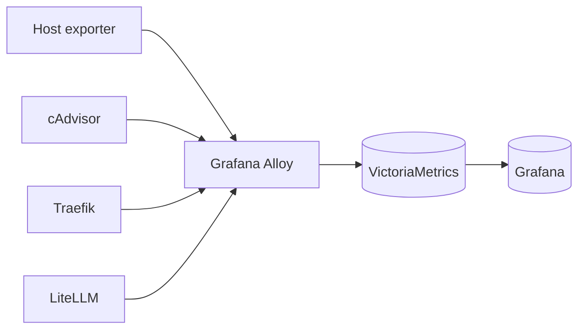

# ServiceHub Monitoring and Alerting

## Monitoring Objectives

- Detect unavailable services and failed health checks.
- Detect ingress, TLS, identity, database, AI, and telemetry failures.
- Understand host, container, network, and disk pressure.
- Correlate service logs with deployment and configuration changes.
- Detect missing or failed backups after RFC-001 defines the required controls.
- Provide evidence for tests, releases, incidents, and capacity decisions.

No current alert-delivery or ownership evidence exists in the repository.

## Metrics Pipeline

- Alloy collects host, container, Traefik, LiteLLM, and self metrics.
- `shared/victoriametrics/scrape.yaml` also scrapes Alloy and LiteLLM.
- VictoriaMetrics publishes port 8428 to the host.
- Grafana uses the provisioned VictoriaMetrics data source.

Metric presence and query results are `Requires runtime validation`.

## Logs Pipeline

Alloy discovers Docker container logs through `/var/run/docker.sock`, applies GeoIP enrichment to Traefik access logs, and pushes logs to VictoriaLogs at `obsvcevlogs:9428`.

VictoriaLogs publishes port 9428 to the host. Grafana uses the provisioned VictoriaLogs data source. Log availability, labels, and retention require runtime validation.

## Dashboards

Grafana provisions JSON files from `shared/grafana/dashboards/` into the `observability` folder.

| Dashboard file | Intended signal |
|---|---|
| `14282_cadvisor-explorter.json` | cAdvisor container metrics |
| `16151_victoriametric-overview.json` | VictoriaMetrics overview |
| `16152_traefik-observability-dashboard.json` | Traefik observability |
| `16153_litellm-proxy-dashboard.json` | LiteLLM proxy |
| `17346_traefik-dashboard.json` | Traefik general metrics |
| `1860_node-exporter-full.json` | Host metrics |
| `19724_docker-dashboard.json` | Docker engine metrics |
| `19792_cadvisor-dashboard.json` | cAdvisor metrics |
| `21743_docker-containers-overview.json` | Container overview |
| `22759-victorialogs-explorer.json` | VictoriaLogs exploration |
| `24585-victorialogs-internal-state.json` | VictoriaLogs internal state |

Dashboard titles, queries, and datasource compatibility are `Requires runtime validation`.

## Platform Signals

| Area | Repository signal | Alert state |
|---|---|---|
| Traefik | `/ping` health, Prometheus metrics, JSON access logs | Alert definition `TBD` |
| Host | Alloy Unix exporter for CPU, memory, network, disk | Thresholds `TBD` |
| Containers | cAdvisor metrics and Docker logs | Thresholds `TBD` |
| Compose health | Service `healthcheck` definitions | Collection into alerts `TBD` |
| Disk capacity | Host exporter and archive warnings | Alert definition `TBD` |
| Backup | Workflow success or failure | Notification integration `TBD` |
| Deployment | Workflow success or failure | Notification integration `TBD` |

## Service-Specific Signals

| Service | Candidate signal |
|---|---|
| Authentik | Server and worker health, login errors, outpost errors |
| Forgejo | `/api/healthz`, request errors, database errors |
| Runner | Process health, non-empty `.runner`, workflow failures |
| Confluence | `/status`, JVM or database errors |
| Open WebUI | Route and container logs |
| Hermes | `/health`, API errors, workspace errors |
| LiteLLM | `/health/liveliness`, `/metrics`, routing and provider errors |
| llama.cpp | `/health`, model-load and resource errors |
| PostgreSQL | `pg_isready`, connection and storage errors |
| MariaDB | MariaDB health, connection and storage errors |
| VictoriaMetrics | `/health`, storage and ingestion errors |
| VictoriaLogs | `/health`, ingestion and storage errors |
| Grafana | `/api/health`, datasource query failures |
| Stalwart | `/healthz/live`, mail, LDAP, certificate, and database errors |
| Bulwark | `/api/health`, JMAP login and backend errors |

Candidate signals are not configured alerts unless repository evidence says otherwise.

## Alert Severity Model

**Proposed and requires owner approval:**

| Severity | Meaning | Response expectation |
|---|---|---|
| Critical | Data loss, security exposure, or platform-wide outage | Immediate escalation; response target TBD |
| High | Major service or recovery control unavailable | Urgent response; target TBD |
| Medium | Degraded service or rising risk | Same-day review; target TBD |
| Low | Informational or capacity trend | Planned review |

No severity thresholds or response targets are committed.

## Recommended Alert Categories

- Ingress, HTTP redirect, and certificate expiry or failure.
- Authentik or forward-auth outage.
- Database health, storage, replication if later added, and connection failures.
- Forgejo or runner unavailability and repeated workflow failure.
- AI local model failure, cloud provider failure, and unexpected privacy-route fallback.
- Host CPU, memory, disk, inode, and network saturation.
- Container restart loops and failed health checks.
- VictoriaMetrics or VictoriaLogs ingestion or query failure.
- Grafana datasource failure.
- Backup missing, failed, too old, too small, or unreadable.
- Restore test overdue once RFC-001 is decided.

## Notification and Ownership

| Item | Value |
|---|---|
| Notification channel | TBD |
| Critical recipient | TBD |
| High recipient | TBD |
| Service owners | Requires owner review |
| Backup owner | Requires owner review |
| Security owner | Requires owner review |
| Escalation contact | TBD |

Grafana has `GF_ALERTING_enabled=true` and `GF_ALERTING_render_only_panels=true`, but no repository evidence defines notification channels or delivery.

## Alert Testing

Alert testing is `Not Executed`.

A future test must:

1. Trigger or simulate each severity.
2. Confirm route, deduplication, recipient, and acknowledgement.
3. Record timestamps and evidence.
4. Confirm quiet-period and recovery behaviour.
5. Verify backup and restore alerts after their controls exist.

## Retention Considerations

| Data | Repository evidence | Decision |
|---|---|---|
| Database backup archives | Approved protected retention input; value not tracked here | Confirm required value and successful retention execution |
| Full archives | Approved protected retention input; value not tracked here | Confirm required value and successful retention execution |
| VictoriaMetrics | No retention option in Compose | TBD |
| VictoriaLogs | No retention option in Compose | TBD |
| Grafana database | Persisted indefinitely under `APPS_DATA` | Review growth |
| Audit and access logs | Collected if containers emit them | Retention and access policy TBD |

## Related Documents

- [Component catalogue](../architecture/COMPONENT-CATALOGUE.md)
- [Service inventory](SERVICE-INVENTORY.md)
- [Troubleshooting](TROUBLESHOOTING.md)
- [RFC-001](../rfc/RFC-001-reliability-and-recovery-baseline.md)
